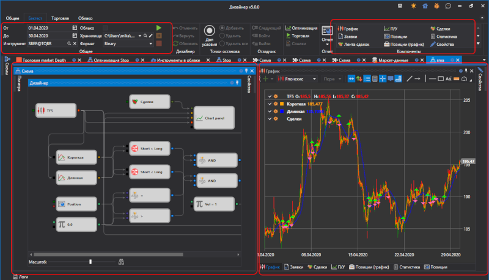

# Интерфейс

Для запуска тестирования на истории необходимо выбрать стратегию, схема которой будет тестироваться на истории. Стратегия выбирается на панели [Схемы](../user_interface/schemas.md) в папке стратегии, двойным нажатием на интересующей стратегии. При выборе стратегии рабочей области появится новая вкладка со стратегией, при переходе на которую в ленте автоматически откроется вкладка **Эмуляция**.

На вкладке **Эмуляция** можно изменить название стратегии и дать ей краткое описание.

Для запуска тестирования на истории необходимо на вкладке **Эмуляция** указать путь к историческим данным в поле **Маркет\-данные** и установить период тестирования. Запускается стратегия на тестирование нажатием кнопки **Старт** . После запуска стратегии на тестирование становятся активными кнопка **Пауза**  приостанавливающая тестирование, кнопка **Стоп**  полностью останавливающая тестирование. При редактировании стратегии полезными будут кнопки **Отменить**(Ctrl+Z)  , отменяющая последнее действие, **Вернуть**(Ctrl+Y)  , возвращающая отменение, **Обновить**(Ctrl+R)  , полностью обновляющая схему. Также с вкладки **Эмуляция** можно воспользоваться **Отладчиком** ([Отладка](debugging.md)) или запустить **Оптимизацию** стратегии.

Вкладка выбранной стратегии по умолчанию содержит следующие панели:

- Панель **Схема**, в которой проходит основной процесс работы по дизайну стратегии и составных элементов, путём комбинирования кубиков и соединительных линий. Панель **Схема** подробно описана в пункте [Дизайнер стратегии](../strategies/using_visual_designer/diagram_panel.md).
- Панель информационных компонентов, содержащая компоненты **График**, **Заявки**, **Сделки**, **Статистика** и др.. Добавить необходимый компонент можно, выбрав его на вкладке **Эмуляция** в группе **Компоненты**.
- Панель **Свойства** по умолчанию свернута справа во вкладке стратегии. На панели **Свойства** можно установить общие настройки **Эмуляции**. Например, **Формат хранилища маркет\-данных** можно установить **BIN** или **CSV**, в зависимости от формата файлов выбранного хранилища. Тип данных Ticks или Candles. При выборе Ticks свечи будут формироваться из тиков [Свойства тестирования](../user_interface/components/backtesting_settings.md).

## См. также

[Свойства тестирования](../user_interface/components/backtesting_settings.md)
