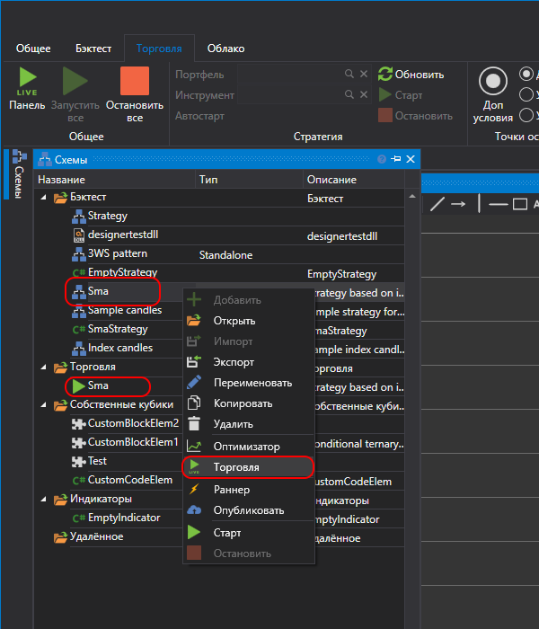
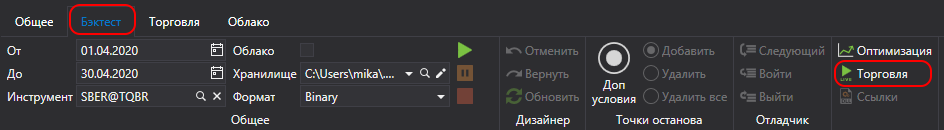

# Добавление стратегии в Live торговлю

Для добавления стратегии в **Live торговлю** необходимо в панели [Схемы](../user_interface/schemas.md) нажать правой кнопкой мыши на необходимой стратегии из папки **Стратегии** и выбрать **Торговля**. Стратегия добавится в папку **Торговля** панели **Схемы**.

Также добавить стратегию в Live торговлю можно нажав на кнопку  **Торговля** на вкладке **Бэктест**.

Папка Торговля содержит стратегии, которые добавлены для запуска в Live торговлю. При этом стратегии, которые запущены, отмечены значком , а которые остановлены, отмечены значком .

## См. также

[Интерфейс](user_interface.md)
