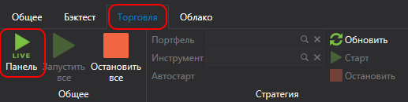
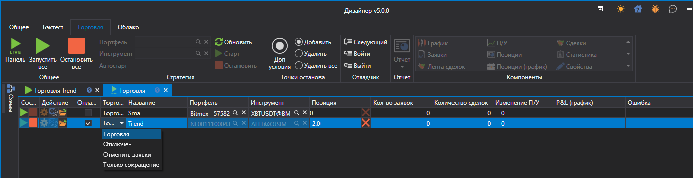

# Панель стратегий

При нажатии на вкладке **Общая** на кнопку **Торговля**  откроется панель **Торговля**.

Панель **Торговля** представляет собой таблицу, на которой отображены все стратегии, добавленные в **Live торговлю**. На панели **Торговля** можно посмотреть текущее состояние стратегии, а также запустить или остановить стратегию кнопками , .

- Первая колонка отвечает за запуск-остановку стратегии
- Вторая колонка за настройки стратегии
- **Онлайн** показывает, все ли индикаторы стратегии сформированы, и все ли подписки перешли в **Онлайн** [состояние](../../api/market_data/subscriptions.md).
- **Торговля** дает возможность изменить доступные операции. Например, запретить открывать новые позиции или увеличивать существующие.
- **Позиция** показывает текущую позицию по инструменту стратегии. При нажатии на кнопку крестик позиция будет закрыта.
- Остальные колонки показывают текущую статистику торговли стратегии.

При двойном нажатии на выбранную строку будет открыта панель со стратегией.

## См. также

[Пример Live торговли](live_execution_sample.md)
