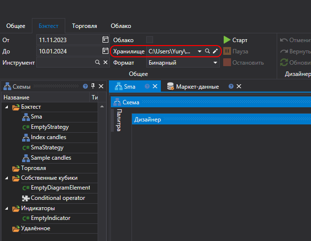

# Скачивание данных

Для получения исторических данных по инструменту необходимо из списка **Все инструменты** выбрать необходимый инструмент, перенести его в список инструментов **Активные**. Установить период исторических данных, выбрать тип и таймфрейм свечей и нажать кнопку **Старт**. Все данные сохранятся в [Хранилище маркет\-данных](../market_data_storage.md).

