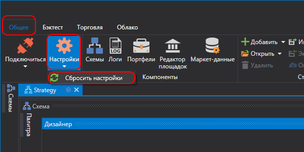
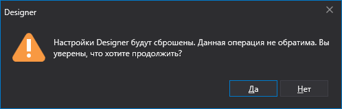

# Сброс настроек

> [!CAUTION]
> **ВНИМАНИЕ\!\!\! Перед сбросом настроек прочтите пункт до конца\!**

На Панели быстрого доступа по умолчанию расположенной в верхней части окна программы, находится кнопка настройки . При нажатии на кнопку  появится возможность сменить режим запуска программы, язык интерфейса, или полностью сбросить настройки.

При выборе **Сбросить настройки** появится окно, требующее подтверждения.

После нажатия кнопки **ОК** все настройки сбросятся до настроек по умолчанию. Директория с настройками программы будет очищена полностью, **все созданные стратегии и скачанные инструменты и другая информация, хранящаяся в директории настроек, будет УНИЧТОЖЕНА**.
