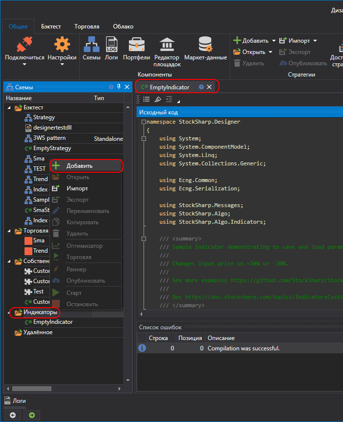
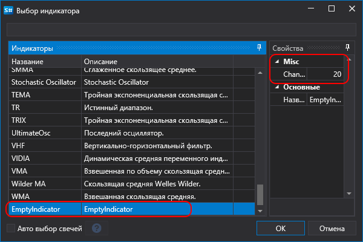

# Создание индикатора

Создание собственного индикатора в [API](../../../../api.md) описано в пункте [Собственный индикатор](../../../../api/indicators/custom_indicator.md). Такие индикаторы полностью совместимы с **Дизайнер**.

Чтобы создать индикатор, на панели **Схемы** необходимо выбрать папку **Индикаторы**, нажать правую кнопку мыши и в контекстном меню выбрать **Добавить**:



Код индикатора будет выглядеть так:

```fsharp
/// <summary>
/// Пример индикатора, показывающий, как сохранять и загружать параметры.
/// Изменяет входную цену на +20% или -20%.
///
/// См. дополнительные примеры:
/// https://github.com/StockSharp/StockSharp/tree/master/Algo/Indicators
///
/// Документация:
/// https://doc.stocksharp.com/topics/designer/strategies/using_code/fsharp/create_own_indicator.html
/// </summary>
type EmptyIndicator() as this =
	inherit BaseIndicator()

	// Внутренние поля
	let mutable changeValue = 20
	let mutable counter = 0
	let mutable isFormedValue = false

	/// <summary>
	/// The percentage value (+/-) used to modify the input price.
	/// </summary>
	member this.Change
		with get () = changeValue
		and set value =
			changeValue <- value
			this.Reset()

	/// <summary>
	/// Defines if the indicator has formed (became ready for trading).
	/// </summary>
	override this.CalcIsFormed() = isFormedValue

	/// <summary>
	/// Сбрасывает индикатор в исходное состояние.
	/// </summary>
	override this.Reset() =
		base.Reset()
		isFormedValue <- false
		counter <- 0

	/// <summary>
	/// Основная логика обработки входных значений.
	/// </summary>
	override this.OnProcess(input: IIndicatorValue) : IIndicatorValue =
		// каждый 10-й вызов пытается вернуть «пустое» значение
		if RandomGen.GetInt(0, 10) = 0 then
			// пустое значение содержит только время, без фактических данных
			DecimalIndicatorValue(this, input.Time)
		else
			// увеличивать счётчик при каждом вызове
			counter <- counter + 1

			// после 5 входных значений индикатор считается сформированным
			if counter = 5 then
				isFormedValue <- true

			let mutable value = input.ToDecimal()

			// случайно изменить на +/- Change%
			let randomFactor = decimal (RandomGen.GetInt(-changeValue, changeValue)) / 100m
			value <- value + (value * randomFactor)

			// return final indicator value
			let result = DecimalIndicatorValue(this, value, input.Time)
			// случайно пометить значение как финальное или нет
			result.IsFinal <- RandomGen.GetBool()
			result

	/// <summary>
	/// Загружает настройки индикатора из заданного <see cref="SettingsStorage"/>.
	/// </summary>
	override this.Load(storage: SettingsStorage) =
		base.Load(storage)
		this.Change <- storage.GetValue<int>(nameof(this.Change))

	/// <summary>
	/// Сохраняет настройки индикатора в заданный <see cref="SettingsStorage"/>.
	/// </summary>
	override this.Save(storage: SettingsStorage) =
		base.Save(storage)
		storage.SetValue(nameof(this.Change), this.Change)

	/// <summary>
	/// Строковое представление, включающее текущее значение <see cref="Change"/>.
	/// </summary>
	override this.ToString() =
		sprintf "Change: %d" this.Change
```

Данный индикатор получает входящее значение и делает у него произвольное отклонение на значение, заданное параметром **Change**.

Описание методов индикатора доступно в разделе [Собственный индикатор](../../../../api/indicators/custom_indicator.md).

Чтобы добавить созданный индикатор на схему, необходимо использовать кубик [Индикатор](../../using_visual_designer/elements/common/indicator.md), и уже в нем задать необходимый индикатор:



Параметр **Change**, ранее заданный в коде индикатора, показан в панели свойств.

> [!WARNING] 
> Индикаторы из F# кода невозможно использовать в стратегиях, созданных на F# коде. Их возможно использовать только в стратегиях, созданных [из кубиков](../../using_visual_designer.md).
