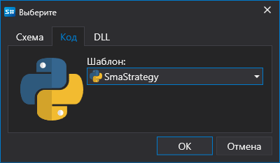
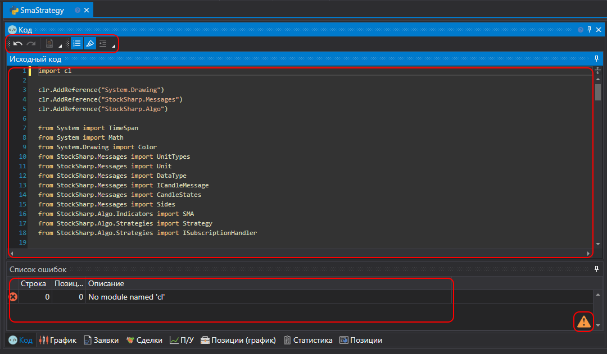

# Использование Python

Создание стратегий из кода \- для пользователей, предпочитающих работу с Python кодом. Такие стратегии не ограничены в возможностях в отличие от схем, и можно описать любой алгоритм.

Процесс создания стратегии проходит напрямую в [Designer](../../../designer.md) или среде разработки на языке **Python** (наиболее популярной из сред разработок является **Visual Studio** и **JetBrains Rider**), используя библиотеку для профессиональной разработки торговых роботов на языке **Python** и [API](../../../api.md).

Добавить новую стратегию можно, нажав на кнопку **Добавить**  во вкладке **Общие** и выбрать **Стратегия**. Или, нажав правой кнопкой мыши на папке **Стратегии** панели **Схемы**, и нажать на кнопку **Добавить**  в выпавшем меню:

После нажатия кнопки **Добавить**  появится окно с выбором типа контента, на котором нужно создать стратегию:

Для создания стратегии из Python кода, необходимо выбрать вторую закладку. Можно также выбрать шаблон, который будет использован в качестве первоначального кода.

После нажатия на **OK** в папке **Стратегии** панели **Схемы** появится новая стратегия, аналогично при создании стратегии из [схемы](../using_visual_designer.md). И аналогичны действия по удалению или переименования стратегии.

Но вместо схемы, будет показ Python редактор кода:

Вкладка редактора кода состоит из панелей **Исходный код** и **Список ошибок**. Панель **Исходный код** содержит сам редактор Python кода. Вверху находится тулбар, где включается или выключается подсветка таких вещей как **Текущая линия**, **Номер строки** и т.д. Для увеличения шрифта можно использовать комбинацию CTRL+КолесоМыши.

Панель **Список ошибок** представляет собой таблицу со списком ошибок в коде, при двойном нажатии на строчку курсор в панели **Исходный код** автоматически перейдет на место ошибки.

При редактировании кода в правом нижнем углу панели **Список ошибок** появится значок , который сигнализирует о том, что началось отслеживание изменений. Компиляция кода происходит в тот момент, когда код перестает изменятся.

Запуск стратегии на [бэктест](../../backtesting/user_interface.md), на [live](../../live_execution/getting_started.md) и другие операции - аналогично работе стратегии из схемы.

## Ограничения

> [!WARNING]
> В [Designer](../../../designer.md) используется IronPython, который имеет следующие ограничения:
> - Совместимость с Python версии 3.4
> - Частичная поддержка numpy через специальную .NET реализацию (пример использования можно посмотреть [здесь](https://github.com/StockSharp/StockSharp/blob/master/Algo.Analytics.Python/pearson_correlation_script.py))
> - Отсутствие поддержки других популярных библиотек, написанных на C (pandas, scipy и т.д.)
> - Ограниченная поддержка асинхронного программирования
> - Невозможность использования некоторых встроенных модулей Python из-за зависимости от специфичных для CPython реализаций
> - Производительность может быть ниже по сравнению с CPython для некоторых операций
>
> Рекомендуется учитывать эти ограничения при разработке торговых стратегий на Python в [Designer](../../../designer.md).