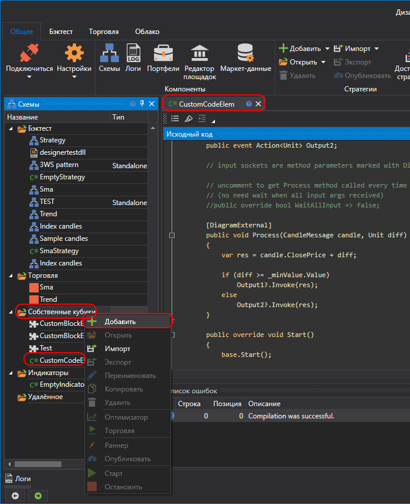
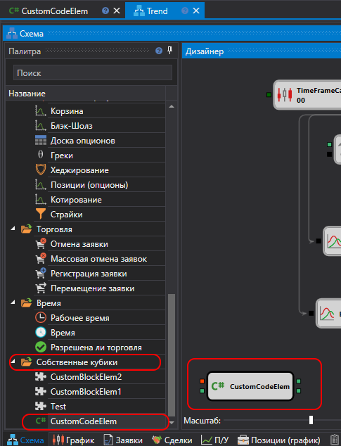

# Создание собственного кубика

Аналогично созданию [кубика из схемы](../../using_visual_designer/composite_elements.md) можно создать свой кубик на основе Python кода. Такой кубик будет более функциональным, чем кубик из схемы.

Для создания кубика из кода, необходимо создать его в папке **Собственные кубики**:



В приведенном ниже примере кубик наследуется от класса [DiagramExternalElement](xref:StockSharp.Diagram.DiagramExternalElement) и выглядит следующим образом:

```python
import clr

# Добавляем ссылки на необходимые сборки StockSharp
clr.AddReference("StockSharp.Messages")
clr.AddReference("StockSharp.Diagram.Core")

# Импортируем необходимые типы из .NET и StockSharp
from System import Action
from StockSharp.Messages import Unit
from StockSharp.Messages import ICandleMessage
from StockSharp.Diagram import DiagramExternalElement

from designer_extensions import diagram_external

# Класс пользовательского элемента диаграммы, показывающий использование входных и выходных сокетов
class empty_diagram_element(DiagramExternalElement):
	"""
	Пример элемента диаграммы, демонстрирующий использование входных и выходных сокетов.

	https://doc.stocksharp.com/topics/designer/strategies/using_code/python/creating_your_own_cube.html
	"""

	def __init__(self):
		super(empty_diagram_element, self).__init__()

		# Пример свойства, показывающий добавление параметров к элементу диаграммы
		# Этот параметр называется "MinValue" и имеет значение по умолчанию 10
		self._minValue = self.AddParam("MinValue", 10)\
							.SetBasic(True)\
							.SetDisplay("Параметры", "Мин. значение", "Описание параметра минимального значения", 10)

		# Инициализировать обработчики выходных событий пустыми списками
		# Подписчики могут назначать этим обработчикам вызываемые методы
		self._output1_handlers = []
		self._output2_handlers = []

	# Выходные сокеты — это события, помеченные атрибутом DiagramExternal

	@diagram_external
	def add_Output1(self, handler: Action[Unit]):
		"""
		Подписаться на событие Output1.
		
		:param handler: Вызываемый метод, который будет вызван при срабатывании Output1.
		"""
		self._output1_handlers.append(handler)

	def remove_Output1(self, handler):
		"""
		Отписаться от события Output1.
		
		:param handler: Вызываемый метод, который нужно удалить из подписчиков Output1.
		"""
		if handler in self._output1_handlers:
			self._output1_handlers.remove(handler)

	@diagram_external
	def add_Output2(self, handler: Action[Unit]):
		"""
		Подписаться на событие Output2.
		
		:param handler: Вызываемый метод, который будет вызван при срабатывании Output2.
		"""
		self._output2_handlers.append(handler)

	def remove_Output2(self, handler):
		"""
		Отписаться от события Output2.
		
		:param handler: Вызываемый метод, который нужно удалить из подписчиков Output2.
		"""
		if handler in self._output2_handlers:
			self._output2_handlers.remove(handler)

	# Раскомментируйте следующее свойство, если хотите, чтобы метод Process 
	# вызывался каждый раз при получении нового аргумента
	# (не нужно ждать получения всех входных аргументов).
	#
	# @property
	# def WaitAllInput(self):
	#     return False
	
	@diagram_external
	def Process(self, candle: ICandleMessage, diff: Unit) -> None:
		"""
		Входные сокеты являются параметрами метода, помеченными атрибутом DiagramExternal.
		Обрабатывает свечу и значение diff, затем вызывает выходные события согласно логике.
		
		:param candle: Входной CandleMessage, представляющий свечу.
		:param diff: Unit, представляющий обрабатываемую разницу.
		"""
		# Рассчитать результат как сумму цены закрытия свечи и значения diff
		res = candle.ClosePrice + diff

		# Вызвать Output1, если diff больше или равен параметру MinValue,
		# иначе вызвать Output2
		if diff >= self._minValue.Value:
			for handler in self._output1_handlers:
				handler(res)
		else:
			for handler in self._output2_handlers:
				handler(res)

	def Start(self):
		"""
		Вызывается при запуске элемента диаграммы. Добавьте здесь логику перед запуском.
		"""
		super(empty_diagram_element, self).Start()
		# Добавить пользовательскую логику, выполняемую перед запуском элемента

	def Stop(self):
		"""
		Вызывается при остановке элемента диаграммы. Добавьте здесь логику после остановки.
		"""
		super(empty_diagram_element, self).Stop()
		# Добавить пользовательскую логику, выполняемую после остановки элемента

	def Reset(self):
		"""
		Вызывается при сбросе элемента диаграммы. Добавьте здесь логику сброса.
		"""
		super(empty_diagram_element, self).Reset()
		# Добавить пользовательскую логику для сброса внутреннего состояния элемента
```

В данном коде кубик имеет два входящих сокета и два исходящих. Входящие сокеты определяются путем применения декоратора @diagram_external к методу:

```python
@diagram_external
def Process(self, candle: ICandleMessage, diff: Unit) -> None:
```

Исходящие сокеты определяются путем применения декоратора @diagram_external к событию (операции подписки на событие add_NNN). В примере кубика таких событий два:

```python
# Выходные сокеты — это события, помеченные атрибутом DiagramExternal

@diagram_external
def add_Output1(self, handler: Action[Unit]):
	"""
	Подписаться на событие Output1.
	
	:param handler: Вызываемый метод, который будет вызван при срабатывании Output1.
	"""
	self._output1_handlers.append(handler)

def remove_Output1(self, handler):
	"""
	Отписаться от события Output1.
	
	:param handler: Вызываемый метод, который нужно удалить из подписчиков Output1.
	"""
	if handler in self._output1_handlers:
		self._output1_handlers.remove(handler)

@diagram_external
def add_Output2(self, handler: Action[Unit]):
	"""
	Подписаться на событие Output2.
	
	:param handler: Вызываемый метод, который будет вызван при срабатывании Output2.
	"""
	self._output2_handlers.append(handler)

def remove_Output2(self, handler):
	"""
	Отписаться от события Output2.
	
	:param handler: Вызываемый метод, который нужно удалить из подписчиков Output2.
	"""
	if handler in self._output2_handlers:
		self._output2_handlers.remove(handler)
```

Поэтому исходящих сокетов будет также два.

Дополнительно показано как сделать свойство у кубика:

```python
self._minValue = self.AddParam("MinValue", 10)\
					.SetBasic(True)\
					.SetDisplay("Параметры", "Мин. значение", "Описание параметра минимального значения", 10)
```

При использовании класса [DiagramElementParam](xref:StockSharp.Diagram.DiagramElementParam`1) автоматически используется подход сохранения и восстановления настроек.

Свойство **MinValue** помечено как basic, и оно будет видно в режиме [Базовые свойства](../../using_visual_designer/diagram_panel.md).

Закомментированное свойство [WaitAllInput](xref:StockSharp.Diagram.DiagramExternalElement.WaitAllInput) отвечает за время вызова метода со входящими сокетами:

```python
# @property
# def WaitAllInput(self):
#     return False
```

Если раскомментировать свойство, то метод **Process** будет вызываться всегда, как только придет хотя бы одно значение (в случае примера это или свеча, или числовое значение).

Чтобы добавить получившийся кубик на схему, необходимо в палитре в разделе **Собственные кубики** выбрать созданный кубик:



> [!WARNING] 
> Кубики из Python кода невозможно использовать в стратегиях, созданных на Python коде. Их возможно использовать только в стратегиях, созданных [из кубиков](../../using_visual_designer.md).

## См. также

[Создание индикатора](create_own_indicator.md)
