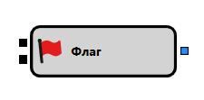

# Флаг

Компонент "Флаг" используется для управления бинарным флагом, который может быть взведен или сброшен в зависимости от входящих сигналов.

## Входящие сокеты

- **Триггер**: Принимает любое значение, кроме `Ложь`. Взводит флаг при первом получении подходящего значения. Если флаг уже взведен, последующие сигналы игнорируются до его сброса.
- **Сброс**: Принимает любое значение, кроме `Ложь`. Сбрасывает флаг, позволяя ему реагировать на последующие триггеры.

## Исходящие сокеты

- **Сигнал**: Выдает сигнал, когда флаг взведен.