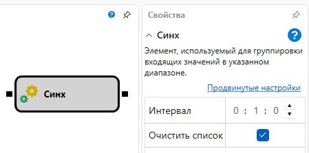
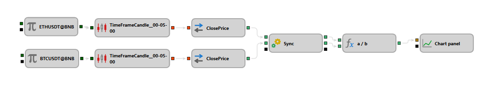

## Синхронизация

Блок Синхронизация предназначен для накопления и синхронизации данных из различных источников (например, свечи по разным инструментам, разные временные рамки, комбинации свечей и сделок) и их последующей выдачи при накоплении определенного количества. Блок полезен при создании собственных индексов или арбитраже.

## Входящие сокеты

- **Входящее**: При подключении нового источника данных автоматически создается соответствующий исходящий сокет и новый входящий сокет. Количество входящих значений не ограничено.

## Параметры

- **Интервал**: Задает время, после которого данные должны быть обновлены или удалены. Если входящее значение поступает с временем, превышающим предыдущее значение плюс интервал, старые данные очищаются, и начинается накопление новой партии данных.
- **Очистка списка**: Если опция активирована, данные очищаются после их накопления для всех подключенных входящих сокетов, либо данные накапливаются до появления данных из следующего временного интервала.

## Пример использования

1. Создание собственного индекса по нескольким акциям, где необходимо учитывать различные временные тайм-серии от разных источников данных.
2. Арбитраж между различными рынками с использованием синхронизированных временных данных для выявления временных различий в ценах.

