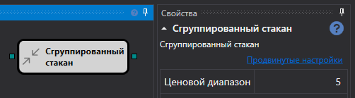
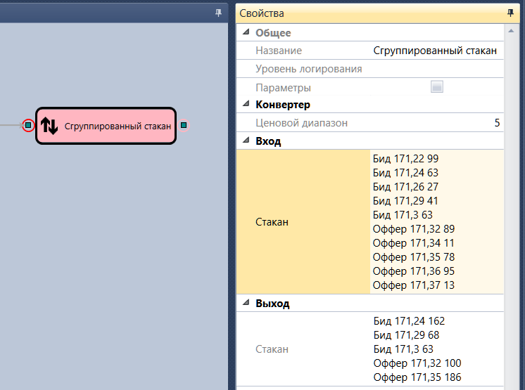

# Сгруппированный стакан

Кубик используется для получения сгруппированного стакана. 

### Входящие сокеты

- **Стакан** – стакан, который надо сгруппировать.

### Исходящие сокеты

- **Стакан** – сгруппированный стакан.

### Параметры

- **Ценовой диапазон** – диапазон цен, в котором будут группироваться заявки.

## См. также

[Разреженный стакан](sparse_order_book.md)
