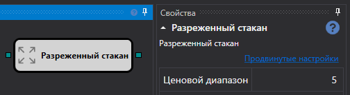
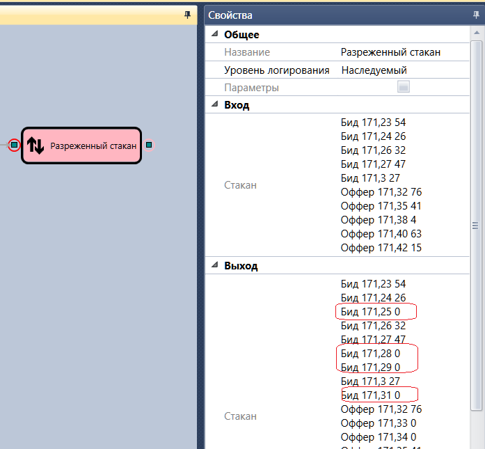

# Разреженный стакан

Кубик используется для получения разреженного стакана по заданному инструменту.

### Входящие сокеты

- **Стакан** – стакан, который надо разредить.

### Исходящие сокеты

- **Стакан** – разреженный стакан.

### Параметры

- **Ценовой диапазон** – диапазон цен, с шагом которого будет разреживание стакана.

## См. также

[Обрезанный стакан](truncated_order_book.md)
