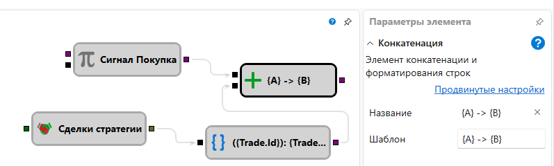

# Конкатенация строк

Кубик объединяет несколько входных значений в одну текстовую строку по шаблону с
плейсхолдерами в фигурных скобках. Каждый плейсхолдер создаёт входной сокет с тем
же именем. Можно обращаться к вложенным свойствам через точку и задавать формат
после двоеточия.

### Входящие сокеты

Входящие сокеты

- Создаются динамически по именам плейсхолдеров. Каждый сокет принимает данные любого типа.

### Исходящие сокеты

Исходящие сокеты

- **Текст** – результирующая конкатенированная и отформатированная строка.

### Параметры

Параметры

- **Шаблон** – шаблон конкатенации и форматирования строк. При его изменении перечень входов обновляется.

### Примеры

- Шаблон `Цена: {price:0.00}, Кол-во: {qty}` с `price = 10.5` и `qty = 2`
  выдаёт `Цена: 10.50, Кол-во: 2`.
- Шаблон `{time:HH:mm:ss} - {trade.Price}` с сокетами `time` и `trade`
  (`trade.Price = 100`) выдаёт `09:15:00 - 100`.
- Шаблон `{side} {volume} @ {trade.Price}` с `side = Buy`, `volume = 1`,
  `trade.Price = 100` выдаёт `Buy 1 @ 100`.

## См. также

[Формат строки](string_format.md)
[Уведомление](notification.md)

