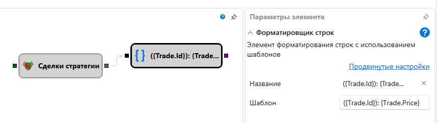

# Формат строки

Кубик преобразует входное значение любого типа в текстовую строку. Преобразование
выполняется по шаблону с плейсхолдерами в фигурных скобках. Каждый плейсхолдер
ссылается на всё значение (`{0}`) или на одно из его свойств (`{Price}`,
`{Trade.Price}` и т. д.). После двоеточия можно указать формат вывода чисел,
дат и других объектов.

### Входящие сокеты

Входящие сокеты

- **Вход** – значение для форматирования. Сокет принимает данные любого типа.

### Исходящие сокеты

Исходящие сокеты

- **Текст** – результат применения шаблона к входному значению.

### Параметры

Параметры

- **Шаблон** – шаблон форматирования строки, применяемый к входному значению. По
  умолчанию используется `{0}`, то есть значение вставляется без дополнительного
  форматирования. В плейсхолдерах можно указывать имена свойств и формат,
  например `Цена: {0:0.00}` или `{Price:0.00}`.

### Примеры

- Шаблон `Цена: {0:0.00}` со входом `10.5` выдаёт `Цена: 10.50`.
- Шаблон `{Price} - {Volume}` со входом `{ Price = 100, Volume = 2 }` выдаёт
  `100 - 2`.
- Шаблон `{Trade.Price} - {Trade.Volume}` со входом
  `{ Trade = { Price = 100, Volume = 2 } }` выдаёт `100 - 2`.
- Шаблон `Время: {Time:HH:mm:ss}` со входом с `Time = 2024-05-01T09:15:00` выдаёт
  `Время: 09:15:00`.

## См. также

[Конкатенация строк](string_concat.md)
[Уведомление](notification.md)
