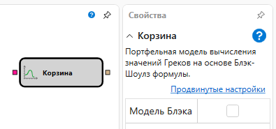
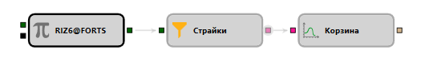

# Корзина

Кубик используется для создания модели расчета опционов.

### Входящие сокеты

Входящие сокеты

- **Опционы** – страйки, для которых необходимо создать модель.

### Исходящие сокеты

Исходящие сокеты

- **Модель** – модель расчета (например, Блэк-Шоулз).

### Параметры

Параметры

- **Модель Блэка** – флаг, указывает создавать ли модель Блэка — Шоулза.

## См. также

[Блэк-Шоулз](black_scholes.md)