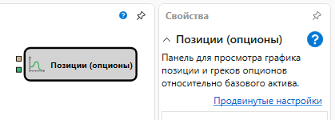
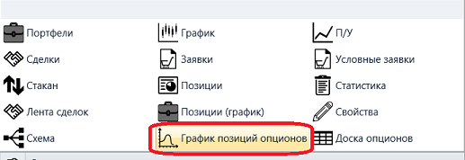
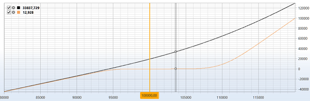

# График позиций опционов

Кубик используется для отображения **Графика позиций опционов**.

Для отображения **Графика позиций опционов** необходимо добавить графический компонент **График позиций опционов**.

### Входящие сокеты

Входящие сокеты

- **Модель** – модель расчета (например, Блэк-Шоулз).
- **Цена базового актива** – цена базового актива.

## См. также

[Блэк\-Шоулз](black_scholes.md)
