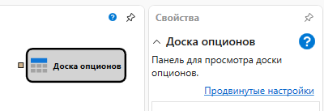
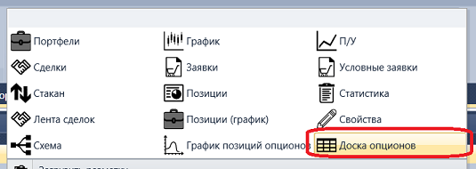
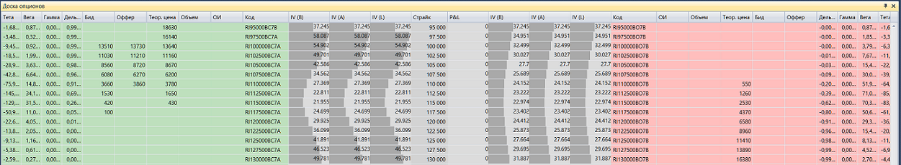

# Доска опционов

Кубик используется для отображения доски опционов.

Для отображения **Доски опционов** необходимо добавить графический компонент **Доска опционов**.

### Входящие сокеты

Входящие сокеты

- **Модель** – модель расчета (например, Блэк-Шоулз).

## См. также

[График позиций опционов](chart_positions.md)
