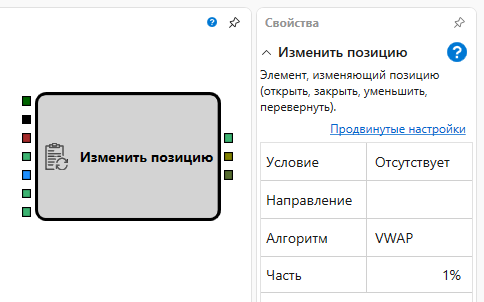

# Изменить позицию

Компонент "Изменить позицию" используется для изменения торговой позиции по заданным условиям.

## Входящие сокеты

- **Инструмент**: Инструмент, по которому будет изменяться позиция.
- **Триггер**: Сигнал для активации изменения позиции.
- **Портфель**: Портфель, в рамках которого происходит операция.
- **Объем** (опционально): Объем для операций "Увеличить" и "Уменьшить". Не используется для "Перевернуть" и "ЗакрытьПозицию".
- **Последняя цена** и **Последний объем**: Для алгоритмов "VWAP" и "Iceberg", требуются данные о последней цене и объеме сделки.
- **Отмена**: Сигнал для отмены набора позиции, например, по таймауту.

## Исходящие сокеты

- **Заявка**: Информация о выставленной заявке.
- **Сделка**: Информация о сделке, совершенной по заявке.
- **Баланс**: Этот сокет передает информацию о том, какая часть позиции не была реализована по окончанию операции изменения позиции. Значение, возвращаемое сокетом, указывает на результат выполнения операции:
  - `0` означает, что кубик успешно завершил операцию изменения позиции, и все запланированные действия были выполнены.
  - `-1` указывает на то, что кубик не начинал изменение позиции из-за несоответствия текущей позиции и заданного условия (например, если текущая позиция отличается от нуля, а условие было "ОткрытьПозицию").
  - Любое значение больше `0` сигнализирует о том, что процесс изменения позиции был прерван до его завершения. Это может произойти из-за отмены через логику схемы или ошибки при регистрации заявки.

## Параметры

- **Условие**: Условия изменения позиции:
  - `Отсутствует`: Не выполняет никаких действий.
  - `ОткрытьПозицию`: Открывает позицию в указанном направлении.
  - `ЗакрытьПозицию`: Закрывает текущую позицию.
  - `Уменьшить`: Уменьшает размер текущей позиции.
  - `Увеличить`: Увеличивает размер текущей позиции.
  - `Перевернуть`: Закрывает текущую позицию и открывает новую в противоположном направлении.
- **Направление**: Указывает направление для условий "ОткрытьПозицию" и "Отсутствует", и является опциональным фильтром для других условий.
- **Тип изменения (набора) позиции**: Варианты включают "МаркетЗаявка", "VWAP", "Iceberg".
- **Часть**: Часть, на которую будет дробиться общий объем в случае использования алгоритмов "VWAP", "Iceberg".

Если компонент получает триггер, когда уже начал изменение объема, он игнорирует новый триггер. Если условия изменения несовместимы с текущим состоянием позиции (например, попытка "ОткрытьПозицию", когда позиция уже открыта), компонент немедленно возвращает `-1` через исходящий сокет **Баланс**, сигнализируя, что операция не требуется и не была начата.

## Примечание

Для работы с заявками на низком уровне можно использовать компонент [Регистрация заявки](../orders/register.md). Для более высокоуровневого управления позициями предлагается использовать этот компонент "Изменить позицию".

## См. также

- [Регистрация заявки](../orders/register.md)
