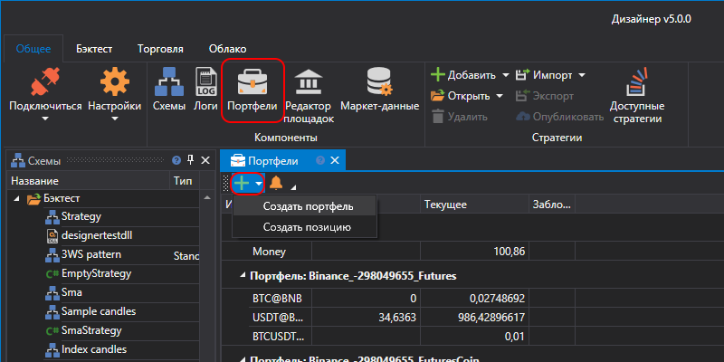
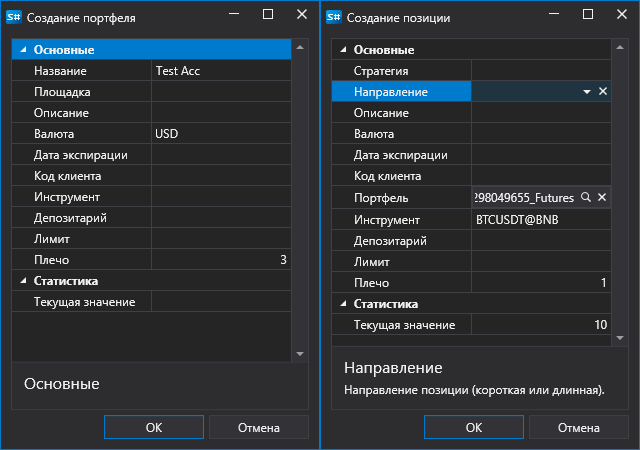

# Портфели

Для работы с портфелями существует панель **Портфели**. Открыть ее можно нажав на кнопку **Портфели** вкладки **Общее**.

Панель **Портфели** представляет собой таблицу, в которой отображены основные данные по портфелю и текущим позициям по этим портфелям. Нажав двойным щелчком на портфеле или позицию появится окно **Создание портфеля** или окно **Создание позиции**, в котором можно отредактировать выбранный портфель или позицию. Для создания нового портфеля или новой позиции необходимо нажать на кнопку , и в выпавшем меню выбрать соответствующий пункт.

При нажатии кнопки  откроется окно [Настройки уведомлений](../../terminal/notifications.md)

## См. также

[Галерея стратегий](../strategy_gallery.md)
