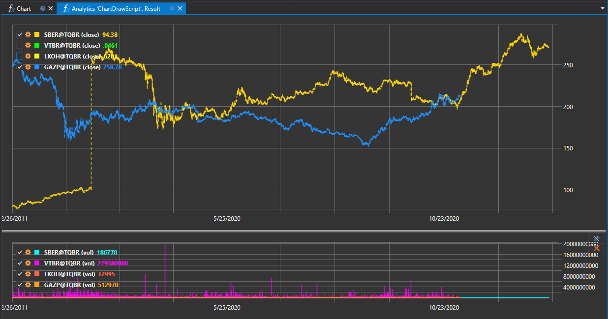

# Создание скрипта

**Аналитика** позволяет создавать свои собственные скрипты. Для примера рассмотрим готовый скрипт **ChartDrawScript**, демонстрирующий возможности построения графиков:

```cs
namespace StockSharp.Algo.Analytics
{
	/// <summary>
	/// The analytic script shows chart drawing capabilities.
	/// </summary>
	public class ChartDrawScript : IAnalyticsScript
	{
		Task IAnalyticsScript.Run(ILogReceiver logs, IAnalyticsPanel panel, SecurityId[] securities, DateTime from, DateTime to, IStorageRegistry storage, IMarketDataDrive drive, StorageFormats format, TimeSpan timeFrame, CancellationToken cancellationToken)
		{
			if (securities.Length == 0)
			{
				logs.AddWarningLog("No instruments.");
				return Task.CompletedTask;
			}

			var lineChart = panel.CreateChart<DateTimeOffset, decimal>();
			var histogramChart = panel.CreateChart<DateTimeOffset, decimal>();

			foreach (var security in securities)
			{
				// stop calculation if user cancel script execution
				if (cancellationToken.IsCancellationRequested)
					break;

				var candlesSeries = new Dictionary<DateTimeOffset, decimal>();
				var volsSeries = new Dictionary<DateTimeOffset, decimal>();

				// get candle storage
				var candleStorage = storage.GetTimeFrameCandleMessageStorage(security, timeFrame, drive, format);

				foreach (var candle in candleStorage.Load(from, to))
				{
					// fill series
					candlesSeries[candle.OpenTime] = candle.ClosePrice;
					volsSeries[candle.OpenTime] = candle.TotalVolume;
				}

				// draw series on chart as line and histogram
				lineChart.Append($"{security} (close)", candlesSeries.Keys, candlesSeries.Values, DrawStyles.DashedLine);
				histogramChart.Append($"{security} (vol)", volsSeries.Keys, volsSeries.Values, DrawStyles.Histogram);
			}

			return Task.CompletedTask;
		}
	}
}
```

## Обзор

Этот скрипт предназначен для построения графиков на основе данных о ценах и объемах финансовых инструментов за определенный временной промежуток. Он реализует интерфейс [IAnalyticsScript](xref:StockSharp.Algo.Analytics.IAnalyticsScript), который определяет контракт для любого аналитического скрипта, который может быть выполнен в программе **Гидра**.

## Интерфейс `IAnalyticsScript`

Интерфейс [IAnalyticsScript](xref:StockSharp.Algo.Analytics.IAnalyticsScript) гарантирует, что любой реализующий аналитический скрипт будет иметь метод [Run](xref:StockSharp.Algo.Analytics.IAnalyticsScript.Run(Ecng.Logging.ILogReceiver,StockSharp.Algo.Analytics.IAnalyticsPanel,StockSharp.Messages.SecurityId[],System.DateTime,System.DateTime,StockSharp.Algo.Storages.IStorageRegistry,StockSharp.Algo.Storages.IMarketDataDrive,StockSharp.Algo.Storages.StorageFormats,System.TimeSpan,System.Threading.CancellationToken)), который является необходимым для выполнения аналитических операций скрипта.

### Метод `Run`

Метод [Run](xref:StockSharp.Algo.Analytics.IAnalyticsScript.Run(Ecng.Logging.ILogReceiver,StockSharp.Algo.Analytics.IAnalyticsPanel,StockSharp.Messages.SecurityId[],System.DateTime,System.DateTime,StockSharp.Algo.Storages.IStorageRegistry,StockSharp.Algo.Storages.IMarketDataDrive,StockSharp.Algo.Storages.StorageFormats,System.TimeSpan,System.Threading.CancellationToken)) является точкой входа аналитического скрипта, где выполняется фактическая обработка данных и аналитические операции.

#### Параметры:

- `logs`: Принимает экземпляр [ILogReceiver](xref:Ecng.Logging.ILogReceiver) для ведения журнала в скрипте.
- `panel`: Предоставляет [IAnalyticsPanel](xref:StockSharp.Algo.Analytics.IAnalyticsPanel), который является элементом пользовательского интерфейса для построения графиков и вывода результатов.
- `securities`: Массив [SecurityId](xref:StockSharp.Messages.SecurityId), идентифицирующий финансовые инструменты для анализа.
- `from`: Дата начала диапазона данных для анализа.
- `to`: Дата окончания диапазона данных для анализа.
- `storage`: Экземпляр [IStorageRegistry](xref:StockSharp.Algo.Storages.IStorageRegistry), позволяющий доступ к хранилищу рыночных данных.
- `drive`: Представляет [IMarketDataDrive](xref:StockSharp.Algo.Storages.IMarketDataDrive) для указания местоположения хранения рыночных данных.
- `format`: Значение [StorageFormats](xref:StockSharp.Algo.Storages.StorageFormats), указывающее формат рыночных данных.
- `timeFrame`: [TimeSpan](xref:System.TimeSpan), указывающий временной промежуток для рыночных данных, например, 1 час или 1 день.
- `cancellationToken`: [CancellationToken](xref:System.Threading.CancellationToken), наблюдающий за запросами отмены.

#### Возвращает:

- [Task](xref:System.Threading.Tasks.Task), представляющий асинхронную операцию аналитического скрипта.

## Детали реализации

Класс `ChartDrawScript` конкретно обрабатывает рыночные данные для каждой предоставленной ценной бумаги. Он создает два типа графиков: линейный график для цен закрытия и гистограмму для данных объемов.

### Основные этапы обработки:

1. Проверить наличие инструментов для обработки. Если их нет, залогировать предупреждение и завершить задачу.
2. Создать линейный график и гистограмму, используя метод [IAnalyticsPanel.CreateChart](xref:StockSharp.Algo.Analytics.IAnalyticsPanel.CreateChart``2).
3. Итерировать по каждой ценной бумаге и проверять запросы на отмену.
4. Получить хранилище свечей, используя метод `storage.GetTimeFrameCandleMessageStorage`.
5. Загрузить данные свечей в указанном диапазоне дат.
6. Заполнить словари серий данными времени открытия, соответствующими ценами закрытия и общими объемами.
7. Нарисовать данные серий на графиках, используя методы `lineChart.Append` и `histogramChart.Append`.

Скрипт использует стили, такие как [DrawStyles.DashedLine](xref:Ecng.Drawing.DrawStyles.DashedLine) для линейного графика и [DrawStyles.Histogram](xref:Ecng.Drawing.DrawStyles.Histogram) для гистограммы, чтобы визуально различать разные представления данных.

Реализуя [IAnalyticsScript](xref:StockSharp.Algo.Analytics.IAnalyticsScript), класс `ChartDrawScript` позволяет интегрировать подход к выполнению настраиваемых аналитических скриптов, делая его универсальным инструментом для трейдеров и аналитиков, использующих платформу StockSharp.

## Результат выполнения


