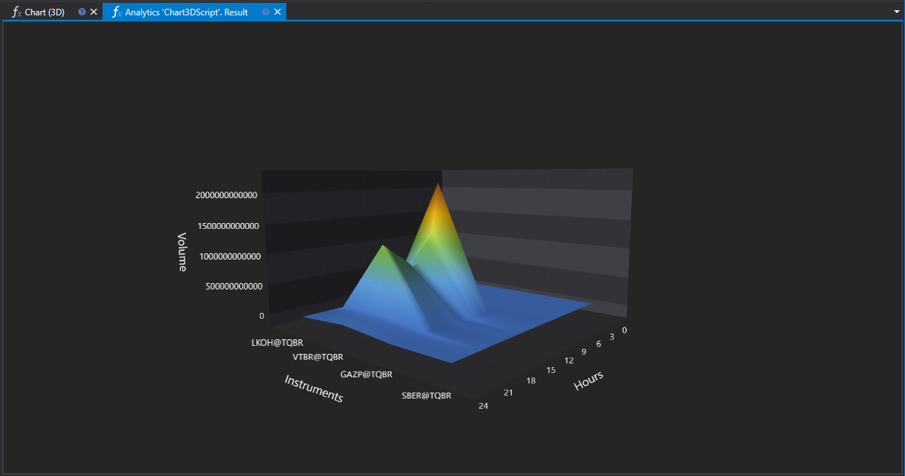

# График 3D

Скрипт `Chart3DScript` демонстрирует создание 3D графика для визуализации распределения объемов торгов по часам для различных финансовых инструментов. Этот метод визуализации позволяет наглядно представить динамику торговли и выявить пики активности на рынке.



## Описание работы скрипта

Скрипт анализирует данные по свечам за указанный период, группирует их по часам и рассчитывает суммарный объем торгов для каждого часа. Результаты представляются в виде 3D графика, где оси представляют собой:

- **Ось X**: Финансовые инструменты.
- **Ось Y**: Часы торговой сессии (от 0 до 23).
- **Ось Z**: Объем торгов.

## Полезность использования 3D графика

### Анализ рыночной активности

3D график позволяет сразу для нескольких инструментов оценить, в какие часы наблюдается наибольшая активность. Это может быть полезно для выявления оптимальных временных окон для торговли или исследования влияния глобальных событий на рынке.

### Сравнение инструментов

Благодаря визуализации объемов торгов по часам в трехмерном пространстве, трейдеры могут сравнивать инструменты между собой по уровню активности и предпочтительным временам сделок. Это может помочь в выборе наиболее ликвидных инструментов в определенные часы или в поиске инструментов с похожими паттернами активности для диверсификации портфеля.

### Оптимизация стратегий

Анализ распределения объемов торгов может служить основой для оптимизации торговых стратегий, позволяя адаптировать их под временные рамки с наибольшей рыночной активностью. Это особенно актуально для алгоритмического и частотного трейдинга.

## Реализация в скрипте

Скрипт выполняет следующие действия:

1. Проверка наличия финансовых инструментов для анализа.
2. Формирование меток для осей X (инструменты) и Y (часы).
3. Загрузка и группирование данных по свечам.
4. Расчет суммарного объема торгов по часам и заполнение данных для оси Z.
5. Отрисовка 3D графика с помощью метода `panel.Draw3D`.

## Код скрипта на C#

```cs
namespace StockSharp.Algo.Analytics
{
	/// <summary>
	/// The analytic script, calculating distribution of the biggest volume by hours
	/// and shows its in 3D chart.
	/// </summary>
	public class Chart3DScript : IAnalyticsScript
	{
		Task IAnalyticsScript.Run(ILogReceiver logs, IAnalyticsPanel panel, SecurityId[] securities, DateTime from, DateTime to, IStorageRegistry storage, IMarketDataDrive drive, StorageFormats format, DataType dataType, CancellationToken cancellationToken)
		{
			if (securities.Length == 0)
			{
				logs.LogWarning("No instruments.");
				return Task.CompletedTask;
			}

			var x = new List<string>();
			var y = new List<string>();

			// fill Y labels
			for (var h = 0; h < 24; h++)
				y.Add(h.ToString());

			var z = new double[securities.Length, y.Count];

			for (var i = 0; i < securities.Length; i++)
			{
				// stop calculation if user cancel script execution
				if (cancellationToken.IsCancellationRequested)
					break;

				var security = securities[i];

				// fill X labels
				x.Add(security.ToStringId());

				// get candle storage
				var candleStorage = storage.GetCandleMessageStorage(security, dataType, drive, format);

				// get available dates for the specified period
				var dates = candleStorage.GetDates(from, to).ToArray();

				if (dates.Length == 0)
				{
					logs.LogWarning("no data");
					return Task.CompletedTask;
				}

				// grouping candles by opening time (time part only) with 1 hour truncating
				var byHours = candleStorage.Load(from, to)
					.GroupBy(c => c.OpenTime.TimeOfDay.Truncate(TimeSpan.FromHours(1)))
					.ToDictionary(g => g.Key.Hours, g => g.Sum(c => c.TotalVolume));

				// fill Z values
				foreach (var pair in byHours)
					z[i, pair.Key] = (double)pair.Value;
			}

			panel.Draw3D(x, y, z, "Instruments", "Hours", "Volume");

			return Task.CompletedTask;
		}
	}
}

```

## Код скрипта на Python

```python
import clr

# Add .NET references
clr.AddReference("StockSharp.Messages")
clr.AddReference("StockSharp.Algo.Analytics")
clr.AddReference("Ecng.Drawing")

from Ecng.Drawing import DrawStyles
from System.Threading.Tasks import Task
from StockSharp.Algo.Analytics import IAnalyticsScript
from storage_extensions import *
from candle_extensions import *
from chart_extensions import *
from numpy_extensions import nx

# The analytic script, calculating distribution of the biggest volume by hours and shows its in 3D chart.
class chart3d_script(IAnalyticsScript):
	def Run(
		self,
		logs,
		panel,
		securities,
		from_date,
		to_date,
		storage,
		drive,
		format,
		data_type,
		cancellation_token
	):
		# Check if there are no instruments
		if not securities:
			logs.LogWarning("No instruments.")
			return Task.CompletedTask

		x = []  # X labels for instruments
		y = []  # Y labels for hours

		# Fill Y labels with hours 0 to 23
		for h in range(24):
			y.append(str(h))

		# Create a 2D array for Z values with dimensions: (number of securities) x (number of hours)
		z = [[0.0 for _ in range(len(y))] for _ in range(len(securities))]

		if data_type is None:
			logs.LogWarning(f"Unsupported data type {data_type}.")
			return Task.CompletedTask

		message_type = data_type.MessageType

		for i, security in enumerate(securities):
			# Stop calculation if user cancels script execution
			if cancellation_token.IsCancellationRequested:
				break

			# Fill X labels with security identifiers
			x.append(to_string_id(security))

			# Get candle storage for current security
			candle_storage = get_candle_storage(storage, security, data_type, drive, format)

			# Get available dates for the specified period
			dates = get_dates(candle_storage, from_date, to_date)

			if len(dates) == 0:
				logs.LogWarning("no data")
				return Task.CompletedTask

			# Grouping candles by opening time (truncated to the nearest hour) and summing volumes
			candles = load_range(candle_storage, message_type, from_date, to_date)
			by_hours = {}
			for candle in candles:
				hour = int(candle.OpenTime.TimeOfDay.TotalHours)
				by_hours[hour] = by_hours.get(hour, 0) + candle.TotalVolume

			# Fill Z values for current security
			for hour, volume in by_hours.items():
				if hour < len(y):
					z[i][hour] = float(volume)

		# Draw the 3D chart using panel
		panel.Draw3D(x, y, nx.to2darray(z), "Instruments", "Hours", "Volume")

		return Task.CompletedTask

```