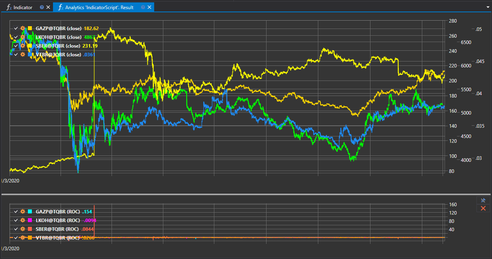

# Индикаторы

Скрипт "Индикатор" предназначен для демонстрации работы с индикаторами технического анализа в рамках платформы StockSharp. Он позволяет пользователям загружать исторические данные, применять к ним различные индикаторы и отображать результаты на графике. Этот подход помогает в анализе рыночных трендов и принятии обоснованных торговых решений.



## Функциональные возможности

Скрипт обеспечивает следующий функционал:

- **Загрузка исторических данных**: Выбор интересующих финансовых инструментов и загрузка их исторических данных за заданный период.
- **Применение индикаторов**: Применение одного или нескольких индикаторов технического анализа к загруженным данным.
- **Визуализация**: Отображение данных и результатов анализа с помощью индикаторов на графике, предоставляя наглядное представление о динамике рынка.

## Примеры индикаторов

Скрипт может работать с широким спектром индикаторов, включая, но не ограничиваясь:

- **Скользящие средние (MA)**: Представляют среднее значение цены за определенный период времени, помогая определить тренды.
- **Индекс относительной силы (RSI)**: Оценивает величину и скорость изменений цен, помогая выявить условия перекупленности или перепроданности.
- **Bollinger Bands (BB)**: Показывают диапазон и волатильность цен, базируясь на скользящих средних и стандартных отклонениях.

## Применение в торговле и анализе

Использование индикаторов технического анализа через данный скрипт позволяет:

- **Определить тренды**: Выявление направления движения рынка для планирования стратегий входа и выхода.
- **Выявить точки разворота**: Определение моментов, когда рыночный тренд может изменить свое направление.
- **Анализировать волатильность**: Оценка уровня нестабильности цен для адаптации стратегий под рыночные условия.

## Реализация в скрипте

Для работы со скриптом необходимо выполнить следующие шаги:

1. **Выбор инструмента и периода**: Определение ценных бумаг и временного диапазона для анализа.
2. **Применение индикаторов**: Выбор и настройка параметров индикаторов, которые будут применены к данным.
3. **Отображение результатов**: Визуализация исторических данных и индикаторов на графике для анализа.

Скрипт "Индикатор" предоставляет мощный инструмент для глубокого анализа финансовых рынков, позволяя трейдерам и аналитикам использовать данные индикаторы для формирования эффективных торговых стратегий.

## Код скрипта на C#

```cs
namespace StockSharp.Algo.Analytics
{
	/// <summary>
	/// The analytic script, using indicator ROC.
	/// </summary>
	public class IndicatorScript : IAnalyticsScript
	{
		Task IAnalyticsScript.Run(ILogReceiver logs, IAnalyticsPanel panel, SecurityId[] securities, DateTime from, DateTime to, IStorageRegistry storage, IMarketDataDrive drive, StorageFormats format, TimeSpan timeFrame, CancellationToken cancellationToken)
		{
			if (securities.Length == 0)
			{
				logs.AddWarningLog("No instruments.");
				return Task.CompletedTask;
			}

			// creating 2 panes for candles and indicator series
			var candleChart = panel.CreateChart<DateTimeOffset, decimal>();
			var indicatorChart = panel.CreateChart<DateTimeOffset, decimal>();

			foreach (var security in securities)
			{
				// stop calculation if user cancel script execution
				if (cancellationToken.IsCancellationRequested)
					break;

				var candlesSeries = new Dictionary<DateTimeOffset, decimal>();
				var indicatorSeries = new Dictionary<DateTimeOffset, decimal>();

				// creating ROC
				var roc = new RateOfChange();

				// get candle storage
				var candleStorage = storage.GetTimeFrameCandleMessageStorage(security, timeFrame, drive, format);

				foreach (var candle in candleStorage.Load(from, to))
				{
					// fill series
					candlesSeries[candle.OpenTime] = candle.ClosePrice;
					indicatorSeries[candle.OpenTime] = roc.Process(candle).GetValue<decimal>();
				}

				// draw series on chart
				candleChart.Append($"{security} (close)", candlesSeries.Keys, candlesSeries.Values);
				indicatorChart.Append($"{security} (ROC)", indicatorSeries.Keys, indicatorSeries.Values);
			}

			return Task.CompletedTask;
		}
	}
}
```

## Код скрипта на Python

```python
import clr

# Add .NET references
clr.AddReference("StockSharp.Messages")
clr.AddReference("StockSharp.Algo.Analytics")
clr.AddReference("Ecng.Drawing")

from Ecng.Drawing import DrawStyles
from System import TimeSpan
from System.Threading.Tasks import Task
from StockSharp.Algo.Analytics import IAnalyticsScript
from StockSharp.Algo.Indicators import ROC
from storage_extensions import *
from candle_extensions import *
from chart_extensions import *
from indicator_extensions import *

# The analytic script, using indicator ROC.
class indicator_script(IAnalyticsScript):
	def Run(self, logs, panel, securities, from_date, to_date, storage, drive, format, time_frame, cancellation_token):
		if not securities:
			logs.LogWarning("No instruments.")
			return Task.CompletedTask

		# creating 2 panes for candles and indicator series
		candle_chart = create_chart(panel, datetime, float)
		indicator_chart = create_chart(panel, datetime, float)

		for security in securities:
			# stop calculation if user cancel script execution
			if cancellation_token.IsCancellationRequested:
				break

			candles_series = {}
			indicator_series = {}

			# creating ROC
			roc = ROC()

			# get candle storage
			candle_storage = get_tf_candle_storage(storage, security, time_frame, drive, format)

			for candle in load_tf_candles(candle_storage, from_date, to_date):
				# fill series
				candles_series[candle.OpenTime] = candle.ClosePrice
				indicator_series[candle.OpenTime] = to_decimal(process_with_candle(roc, candle))

			# draw series on chart
			candle_chart.Append(
				f"{security} (close)",
				list(candles_series.keys()),
				list(candles_series.values())
			)
			indicator_chart.Append(
				f"{security} (ROC)",
				list(indicator_series.keys()),
				list(indicator_series.values())
			)

		return Task.CompletedTask
```