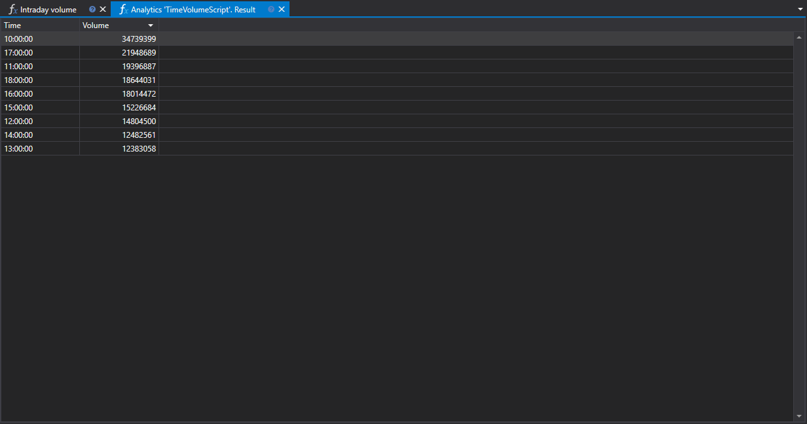

# Внутридневной объем

Скрипт "Объем внутри дня" представляет собой инструмент для анализа распределения торгового объема ценных бумаг по часам в рамках одной торговой сессии. Скрипт предназначен для использования в рамках платформы StockSharp и ориентирован на трейдеров и квант-аналитиков, целью которых является глубокое изучение рыночного поведения и оптимизация торговых стратегий.



## Описание функционала

Скрипт выполняет сбор данных о торговых операциях за выбранный временной промежуток и представляет их в виде графика, позволяя пользователю визуализировать изменения объема торгов по часам. Это дает возможность оценить, в какие часы дня наблюдается повышенная или пониженная торговая активность.

## Практическая значимость

- **Для трейдинга**: Понимание пиковых и спадных часов помогает определить наиболее активные периоды рынка, что может влиять на решение о времени входа или выхода из позиций.
- **Для квантового анализа**: Квант-аналитики могут использовать данные об объеме внутри дня для создания математических моделей и алгоритмов, предсказывающих рыночное поведение на основе объемных показателей.

## Распределение по часам

Распределение торгового объема по часам даёт понимание о динамике рынка, выделяя те временные интервалы, когда происходит основная торговая активность. Это может указывать на изменение трендов, уровней поддержки и сопротивления, а также на возможные моменты увеличения ликвидности или её недостатка.

## Применение данных

Скрипт "Объем внутри дня" может быть интегрирован в более широкую систему рыночного анализа, предоставляя данные, которые могут использоваться для:

- **Адаптации стратегий**: Настройка параметров торговых алгоритмов в соответствии с уровнями рыночной активности.
- **Оценки рисков**: Расчет вероятности существенных ценовых движений в зависимости от времени суток.

Использование скрипта "Объем внутри дня" в контексте торговой платформы StockSharp позволяет трейдерам и аналитикам обосновывать свои решения на основе конкретных данных о рыночной активности и адаптировать свои стратегии, чтобы максимально соответствовать текущим условиям торговли.

## Код скрипта на C#

```cs
namespace StockSharp.Algo.Analytics
{
	/// <summary>
	/// The analytic script, calculating distribution of the biggest volume by hours.
	/// </summary>
	public class TimeVolumeScript : IAnalyticsScript
	{
		Task IAnalyticsScript.Run(ILogReceiver logs, IAnalyticsPanel panel, SecurityId[] securities, DateTime from, DateTime to, IStorageRegistry storage, IMarketDataDrive drive, StorageFormats format, TimeSpan timeFrame, CancellationToken cancellationToken)
		{
			if (securities.Length == 0)
			{
				logs.AddWarningLog("No instruments.");
				return Task.CompletedTask;
			}

			// script can process only 1 instrument
			var security = securities.First();

			// get candle storage
			var candleStorage = storage.GetTimeFrameCandleMessageStorage(security, timeFrame, drive, format);

			// get available dates for the specified period
			var dates = candleStorage.GetDates(from, to).ToArray();

			if (dates.Length == 0)
			{
				logs.AddWarningLog("no data");
				return Task.CompletedTask;
			}

			// grouping candles by opening time (time part only) with 1 hour truncating
			var rows = candleStorage.Load(from, to)
				.GroupBy(c => c.OpenTime.TimeOfDay.Truncate(TimeSpan.FromHours(1)))
				.ToDictionary(g => g.Key, g => g.Sum(c => c.TotalVolume));

			// put our calculations into grid
			var grid = panel.CreateGrid("Time", "Volume");

			foreach (var row in rows)
				grid.SetRow(row.Key, row.Value);

			// sorting by volume column (descending)
			grid.SetSort("Volume", false);

			return Task.CompletedTask;
		}
	}
}
```

## Код скрипта на Python

```python
import clr

# Add .NET references
clr.AddReference("StockSharp.Algo.Analytics")
clr.AddReference("StockSharp.Messages")
clr.AddReference("Ecng.Drawing")

from Ecng.Drawing import DrawStyles
from System import TimeSpan
from System.Threading.Tasks import Task
from StockSharp.Algo.Analytics import IAnalyticsScript
from storage_extensions import *
from candle_extensions import *
from chart_extensions import *
from indicator_extensions import *

# The analytic script, calculating distribution of the biggest volume by hours.
class time_volume_script(IAnalyticsScript):
    def Run(
        self,
        logs,
        panel,
        securities,
        from_date,
        to_date,
        storage,
        drive,
        format,
        time_frame,
        cancellation_token
    ):
        # Check if there are no instruments
        if not securities:
            logs.LogWarning("No instruments.")
            return Task.CompletedTask

        # Script can process only 1 instrument
        security = securities[0]

        # Get candle storage
        candle_storage = get_tf_candle_storage(storage, security, time_frame, drive, format)

        # Get available dates for the specified period
        dates = get_dates(candle_storage, from_date, to_date)

        if len(dates) == 0:
            logs.LogWarning("no data")
            return Task.CompletedTask

        # Grouping candles by opening time (hourly truncation) and summing their volumes
        candles = load_tf_candles(candle_storage, from_date, to_date)
        rows = {}
        for candle in candles:
            # Truncate TimeOfDay to the nearest hour
            time_of_day = candle.OpenTime.TimeOfDay
            truncated = TimeSpan.FromHours(int(time_of_day.TotalHours))
            # Sum volumes for each truncated hour
            rows[truncated] = rows.get(truncated, 0) + candle.TotalVolume

        # Put our calculations into grid
        grid = panel.CreateGrid("Time", "Volume")

        for key, value in rows.items():
            grid.SetRow(key, value)

        # Sorting by Volume column in descending order
        grid.SetSort("Volume", False)

        return Task.CompletedTask
```