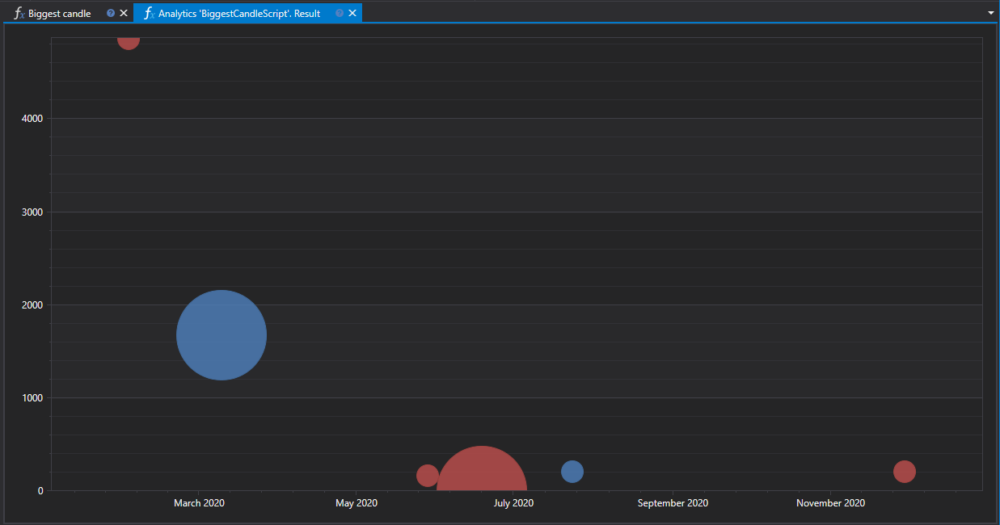

# Крупнейшие свечи

Скрипт "Крупнейшие свечи" разработан для выявления свечей с максимальным объемом и наибольшей длиной тела на графиках выбранных финансовых инструментов за заданный временной период. Этот инструмент позволяет трейдерам и аналитикам идентифицировать значимые рыночные события и реакцию участников рынка.



## Ключевые возможности

Скрипт анализирует набор заданных инструментов, ищет среди них свечи с наибольшим объемом и длиной тела, и отображает эти данные в виде двух графиков:

- **График по длине тела свечи**: Показывает свечи с наибольшей разницей между ценой открытия и закрытия.
- **График по объему торгов**: Демонстрирует свечи с максимальным объемом торгов за время существования свечи.

## Процесс работы

1. **Выбор инструментов и периода анализа**: Определяется список инструментов и временной интервал для анализа.
2. **Анализ данных**: Происходит загрузка и анализ исторических данных свечей для выявления свечей с наибольшими показателями.
3. **Визуализация результатов**: Найденные свечи отображаются на графиках в интерфейсе аналитической панели.

## Применение

- **Анализ рыночной активности**: Помогает определить моменты наибольшей активности трейдеров и потенциальные рыночные развороты.
- **Определение ключевых уровней**: Свечи с большим объемом и длиной тела часто формируются около ключевых уровней поддержки и сопротивления.
- **Стратегическое планирование**: Информация о крупнейших свечах может быть использована для планирования точек входа и выхода из рынка, учитывая потенциальную волатильность.

## Код скрипта

```cs
namespace StockSharp.Algo.Analytics
{
	/// <summary>
	/// The analytic script, shows biggest candle (by volume and by length) for specified securities.
	/// </summary>
	public class BiggestCandleScript : IAnalyticsScript
	{
		Task IAnalyticsScript.Run(ILogReceiver logs, IAnalyticsPanel panel, SecurityId[] securities, DateTime from, DateTime to, IStorageRegistry storage, IMarketDataDrive drive, StorageFormats format, TimeSpan timeFrame, CancellationToken cancellationToken)
		{
			if (securities.Length == 0)
			{
				logs.AddWarningLog("No instruments.");
				return Task.CompletedTask;
			}

			var priceChart = panel.CreateChart<DateTimeOffset, decimal, decimal>();
			var volChart = panel.CreateChart<DateTimeOffset, decimal, decimal>();

			var bigPriceCandles = new List<CandleMessage>();
			var bigVolCandles = new List<CandleMessage>();

			foreach (var security in securities)
			{
				// stop calculation if user cancel script execution
				if (cancellationToken.IsCancellationRequested)
					break;

				// get candle storage
				var candleStorage = storage.GetTimeFrameCandleMessageStorage(security, timeFrame, drive, format);

				var allCandles = candleStorage.Load(from, to).ToArray();

				// first orders by volume desc will be our biggest candle
				var bigPriceCandle = allCandles.OrderByDescending(c => c.GetLength()).FirstOrDefault();
				var bigVolCandle = allCandles.OrderByDescending(c => c.TotalVolume).FirstOrDefault();

				if (bigPriceCandle != null)
					bigPriceCandles.Add(bigPriceCandle);

				if (bigVolCandle != null)
					bigVolCandles.Add(bigVolCandle);
			}

			// draw series on chart
			priceChart.Append("prices", bigPriceCandles.Select(c => c.OpenTime), bigPriceCandles.Select(c => c.GetMiddlePrice(null)), bigPriceCandles.Select(c => c.GetLength()));
			volChart.Append("prices", bigVolCandles.Select(c => c.OpenTime), bigPriceCandles.Select(c => c.GetMiddlePrice(null)), bigVolCandles.Select(c => c.TotalVolume));

			return Task.CompletedTask;
		}
	}
}
```