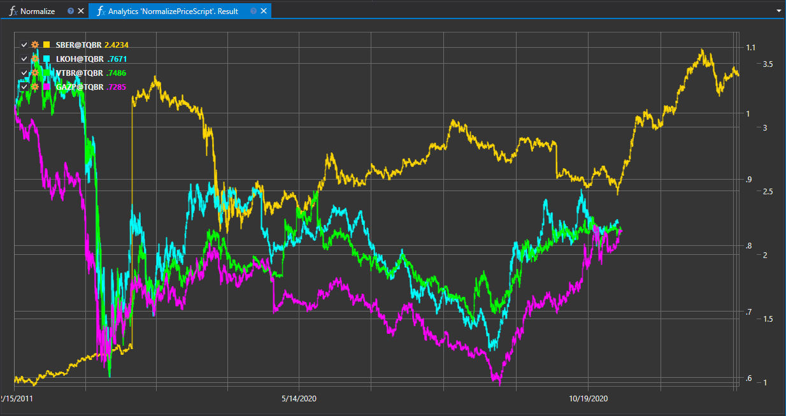

# Нормализация цен закрытия

Скрипт "Нормализация цен закрытия" предназначен для приведения цен закрытия финансовых инструментов к общему виду, что позволяет провести сопоставление и анализ различных активов на одной шкале. Это особенно полезно при сравнении инструментов с разной стоимостью и волатильностью.



## Описание работы скрипта

Скрипт выполняет адаптацию данных о ценах закрытия путем их масштабирования или преобразования в соответствии с выбранным методом нормализации. Результатом является набор стандартизированных значений, которые могут быть использованы для количественного сравнения и мультиинструментального анализа.

## Применение нормализации

- **Унификация шкалы цен**: Нормализация помогает привести данные различных инструментов к единой шкале, упрощая визуальное сравнение и аналитическую оценку.
- **Анализ корреляций**: Стандартизированные данные позволяют выявлять корреляционные связи между активами и формировать диверсифицированные портфели.
- **Создание индексов и моделей**: Нормализованные цены используются для создания композитных индексов, моделей ценообразования и других квантовых исследований.

## Методика нормализации

Нормализация может включать следующие методы:

1. **Масштабирование**: Приведение цен закрытия к определенному диапазону значений, например от 0 до 1.
2. **Z-оценка**: Преобразование цен закрытия с использованием Z-оценки, которая показывает, на сколько стандартных отклонений значение отклоняется от среднего.
3. **Логарифмирование**: Применение логарифмического преобразования для сглаживания разброса данных и снижения влияния экстремальных значений.

## Реализация скрипта

Процесс нормализации обычно включает следующие шаги:

1. **Выбор нормализации**: Определение метода нормализации в зависимости от целей анализа и характеристик данных.
2. **Обработка данных**: Применение выбранного метода нормализации к ценам закрытия для каждого инструмента.
3. **Анализ результатов**: Использование нормализованных данных для последующего анализа и сравнения инструментов.

Скрипт "Нормализация цен закрытия" является важным инструментом для подготовки данных к торговому и квантовому анализу, позволяя трейдерам и аналитикам более точно сравнивать и оценивать финансовые активы в рамках различных стратегий и исследований.

## Код скрипта на C#

```cs
namespace StockSharp.Algo.Analytics
{
	/// <summary>
	/// The analytic script, normalize securities close prices and shows on same chart.
	/// </summary>
	public class NormalizePriceScript : IAnalyticsScript
	{
		Task IAnalyticsScript.Run(ILogReceiver logs, IAnalyticsPanel panel, SecurityId[] securities, DateTime from, DateTime to, IStorageRegistry storage, IMarketDataDrive drive, StorageFormats format, DataType dataType, CancellationToken cancellationToken)
		{
			if (securities.Length == 0)
			{
				logs.LogWarning("No instruments.");
				return Task.CompletedTask;
			}

			var chart = panel.CreateChart<DateTimeOffset, decimal>();

			foreach (var security in securities)
			{
				// stop calculation if user cancel script execution
				if (cancellationToken.IsCancellationRequested)
					break;

				var series = new Dictionary<DateTimeOffset, decimal>();

				// get candle storage
				var candleStorage = storage.GetCandleMessageStorage(security, dataType, drive, format);

				decimal? firstClose = null;

				foreach (var candle in candleStorage.Load(from, to))
				{
					firstClose ??= candle.ClosePrice;

					// normalize close prices by dividing on first close
					series[candle.OpenTime] = candle.ClosePrice / firstClose.Value;
				}

				// draw series on chart
				chart.Append(security.ToStringId(), series.Keys, series.Values);
			}

			return Task.CompletedTask;
		}
	}
}

```

## Код скрипта на Python

```python
import clr

# Add .NET references
clr.AddReference("StockSharp.Messages")
clr.AddReference("StockSharp.Algo.Analytics")
clr.AddReference("Ecng.Drawing")

from Ecng.Drawing import DrawStyles
from System.Threading.Tasks import Task
from StockSharp.Algo.Analytics import IAnalyticsScript
from storage_extensions import *
from candle_extensions import *
from chart_extensions import *
from indicator_extensions import *

# The analytic script, normalize securities close prices and shows on same chart.
class normalize_price_script(IAnalyticsScript):
	def Run(self, logs, panel, securities, from_date, to_date, storage, drive, format, data_type, cancellation_token):
		if not securities:
			logs.LogWarning("No instruments.")
			return Task.CompletedTask

		chart = create_chart(panel, datetime, float)

		if data_type is None:
			logs.LogWarning(f"Unsupported data type {data_type}.")
			return Task.CompletedTask

		message_type = data_type.MessageType

		for security in securities:
			# stop calculation if user cancel script execution
			if cancellation_token.IsCancellationRequested:
				break

			series = {}

			# get candle storage
			candle_storage = get_candle_storage(storage, security, data_type, drive, format)

			first_close = None

			for candle in load_range(candle_storage, message_type, from_date, to_date):
				if first_close is None:
					first_close = candle.ClosePrice

				# normalize close prices by dividing on first close
				series[candle.OpenTime] = candle.ClosePrice / first_close

			# draw series on chart
			chart.Append(to_string_id(security), list(series.keys()), list(series.values()))

		return Task.CompletedTask

```