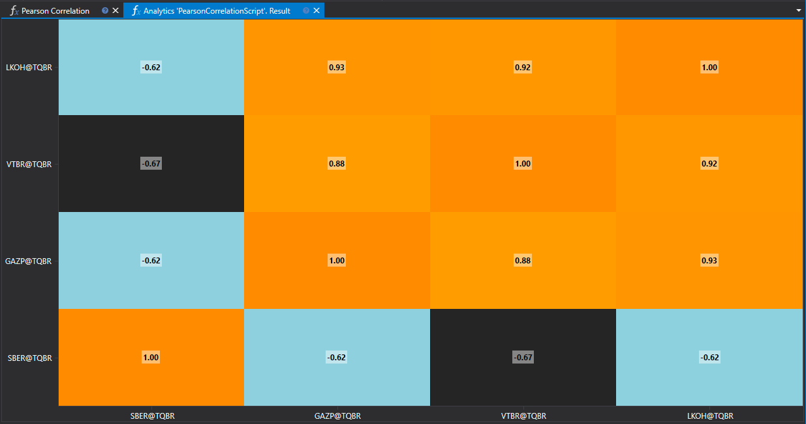

# Корреляция Пирсона

Корреляция Пирсона является статистическим методом, позволяющим оценить степень линейной связи между двумя количественными переменными. В контексте финансового анализа, этот метод широко используется для изучения взаимосвязей между различными активами, например, акциями или валютными парами.



## Описание метода

Коэффициент корреляции Пирсона принимает значения от -1 до 1, где:

- **1** означает полную положительную корреляцию,
- **0** указывает на отсутствие линейной связи,
- **-1** обозначает полную отрицательную корреляцию.

Значение коэффициента показывает, насколько тесно две переменные связаны линейной зависимостью.

## Практическое применение

- **Портфельное управление**: Оценка корреляций между активами помогает в построении диверсифицированных портфелей для снижения риска.
- **Стратегии хеджирования**: Выявление активов с высокой отрицательной корреляцией может быть использовано для разработки стратегий хеджирования.
- **Анализ рыночных тенденций**: Изучение корреляций между разными рынками и инструментами дает представление о глобальных экономических взаимосвязях.

## Вычисление корреляции Пирсона

Для расчёта коэффициента корреляции Пирсона используется следующая формула:

\[ r = \frac{n(\sum xy) - (\sum x)(\sum y)}{\sqrt{[n\sum x^2 - (\sum x)^2][n\sum y^2 - (\sum y)^2]}} \]

где:
- \(n\) — количество наблюдений,
- \(x\) и \(y\) — значения переменных,
- \(\sum\) — символ суммирования.

## Реализация в скрипте

Скрипт для расчёта корреляции Пирсона должен включать следующие шаги:

1. **Сбор данных**: Загрузка временных рядов для двух анализируемых переменных.
2. **Предварительная обработка**: Выравнивание временных рядов по датам и удаление пропусков.
3. **Расчёт**: Применение формулы корреляции Пирсона к обработанным данным.
4. **Анализ результатов**: Интерпретация полученного коэффициента корреляции для принятия решений.

Расчёт корреляции Пирсона предоставляет важную информацию для анализа рынка и оптимизации инвестиционных стратегий, позволяя оценить степень взаимного влияния финансовых активов.

## Код скрипта на C#

```cs
namespace StockSharp.Algo.Analytics
{
	using MathNet.Numerics.Statistics;

	/// <summary>
	/// The analytic script, calculating Pearson correlation by specified securities.
	/// </summary>
	public class PearsonCorrelationScript : IAnalyticsScript
	{
		Task IAnalyticsScript.Run(ILogReceiver logs, IAnalyticsPanel panel, SecurityId[] securities, DateTime from, DateTime to, IStorageRegistry storage, IMarketDataDrive drive, StorageFormats format, TimeSpan timeFrame, CancellationToken cancellationToken)
		{
			if (securities.Length == 0)
			{
				logs.AddWarningLog("No instruments.");
				return Task.CompletedTask;
			}

			var closes = new List<double[]>();

			foreach (var security in securities)
			{
				// stop calculation if user cancel script execution
				if (cancellationToken.IsCancellationRequested)
					break;

				// get candle storage
				var candleStorage = storage.GetTimeFrameCandleMessageStorage(security, timeFrame, drive, format);

				// get closing prices
				var prices = candleStorage.Load(from, to).Select(c => (double)c.ClosePrice).ToArray();

				if (prices.Length == 0)
				{
					logs.AddWarningLog("No data for {0}", security);
					return Task.CompletedTask;
				}

				closes.Add(prices);
			}

			// all array must be same length, so truncate longer
			var min = closes.Select(arr => arr.Length).Min();

			for (var i = 0; i < closes.Count; i++)
			{
				var arr = closes[i];

				if (arr.Length > min)
					closes[i] = arr.Take(min).ToArray();
			}

			// calculating correlation
			var matrix = Correlation.PearsonMatrix(closes);

			// displaing result into heatmap
			var ids = securities.Select(s => s.ToStringId());
			panel.DrawHeatmap(ids, ids, matrix.ToArray());

			return Task.CompletedTask;
		}
	}
}
```

## Код скрипта на Python

```python
import clr

# Add .NET references
clr.AddReference("StockSharp.Messages")
clr.AddReference("StockSharp.Algo.Analytics")
clr.AddReference("Ecng.Drawing")

from Ecng.Drawing import DrawStyles
from System import TimeSpan
from System.Threading.Tasks import Task
from StockSharp.Algo.Analytics import IAnalyticsScript
from storage_extensions import *
from candle_extensions import *
from chart_extensions import *
from indicator_extensions import *
from numpy_extensions import nx

clr.AddReference("NumpyDotNet")
from NumpyDotNet import np

# The analytic script, calculating Pearson correlation by specified securities.
class pearson_correlation_script(IAnalyticsScript):
    def Run(
        self,
        logs,
        panel,
        securities,
        from_date,
        to_date,
        storage,
        drive,
        format,
        time_frame,
        cancellation_token
    ):
        if not securities:
            logs.LogWarning("No instruments.")
            return Task.CompletedTask

        closes = []

        for security in securities:
            # stop calculation if user cancel script execution
            if cancellation_token.IsCancellationRequested:
                break

            # get candle storage
            candle_storage = get_tf_candle_storage(storage, security, time_frame, drive, format)

            # get closing prices
            prices = [float(c.ClosePrice) for c in load_tf_candles(candle_storage, from_date, to_date)]

            if len(prices) == 0:
                logs.LogWarning("No data for {0}", security)
                return Task.CompletedTask

            closes.append(prices)

        # all arrays must be the same length, so truncate longer ones
        min_length = min(len(arr) for arr in closes)
        closes = [arr[:min_length] for arr in closes]
        
        # convert list or array into 2D array
        array2d = nx.to2darray(closes)
        
        # calculating correlation using NumSharp
        np_array = np.array(array2d)
        matrix = np.corrcoef(np_array)

        # displaying result into heatmap
        ids = [to_string_id(s) for s in securities]
        panel.DrawHeatmap(ids, ids, nx.tosystemarray(matrix))

        return Task.CompletedTask
```