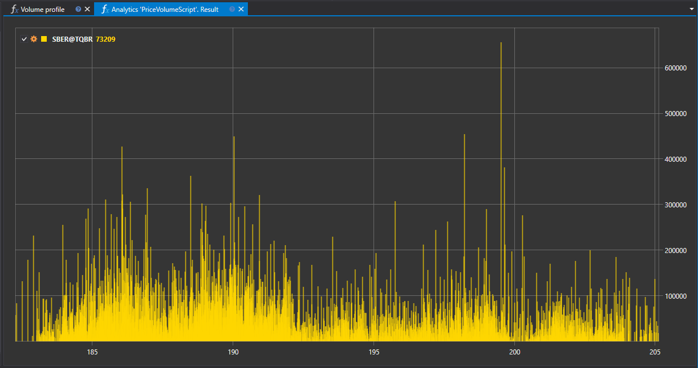

# Профиль объема

Скрипт "Профиль объема" представляет инструмент для анализа распределения торгового объема по ценам за выбранный период времени. Инструмент позволяет трейдерам и квант-аналитикам визуализировать и анализировать, на каких ценовых уровнях была сосредоточена основная торговая активность.



## Описание функционала

Скрипт обеспечивает агрегацию данных о сделках и формирует профиль, который отображает объемы, исполненные на различных уровнях цен. Эта информация может быть представлена в виде графика, который иллюстрирует плотность торгов на различных ценовых уровнях.

## Практическая значимость

Анализ профиля объема помогает в определении ключевых зон спроса и предложения и может быть использован для:

- Выявления уровней поддержки и сопротивления, на которых инструмент находит большой интерес со стороны участников рынка.
- Оценки силы текущего тренда или его потенциального ослабления, основываясь на изменении распределения объемов.
- Планирования точек входа и выхода из рынка, учитывая уровни с максимальной аккумулированной ликвидности.

## Применение в трейдинге и квант-анализе

- **Трейдинг**: Профиль объема может быть использован для разработки стратегий на основе объемного анализа, предоставляя четкое представление о том, где происходят основные торговые операции.
- **Квант-анализ**: Данные о распределении объемов могут служить входными данными для квантовых моделей, предсказывающих вероятность ценовых движений в зависимости от накопленного на уровне объема.

## Реализация скрипта

Скрипт "Профиль объема" выполняет следующие шаги:

1. **Сбор данных**: Скрипт агрегирует данные о сделках за указанный период.
2. **Формирование профиля**: На основе собранных данных скрипт формирует профиль объема, отражающий торговую активность на каждом ценовом уровне.
3. **Визуализация**: Результаты работы скрипта визуализируются в виде графика или гистограммы, где каждый бар соответствует определенному ценовому уровню и его торговому объему.

Использование скрипта "Профиль объема" в контексте платформы StockSharp позволяет проводить комплексный анализ рынка, строить обоснованные торговые гипотезы и улучшать качество принимаемых торговых решений.

## Код скрипта на C#

```cs
namespace StockSharp.Algo.Analytics
{
	/// <summary>
	/// The analytic script, calculating distribution of the volume by price levels.
	/// </summary>
	public class PriceVolumeScript : IAnalyticsScript
	{
		Task IAnalyticsScript.Run(ILogReceiver logs, IAnalyticsPanel panel, SecurityId[] securities, DateTime from, DateTime to, IStorageRegistry storage, IMarketDataDrive drive, StorageFormats format, TimeSpan timeFrame, CancellationToken cancellationToken)
		{
			if (securities.Length == 0)
			{
				logs.AddWarningLog("No instruments.");
				return Task.CompletedTask;
			}

			// script can process only 1 instrument
			var security = securities.First();

			// get candle storage
			var candleStorage = storage.GetTimeFrameCandleMessageStorage(security, timeFrame, drive, format);

			// get available dates for the specified period
			var dates = candleStorage.GetDates(from, to).ToArray();

			if (dates.Length == 0)
			{
				logs.AddWarningLog("no data");
				return Task.CompletedTask;
			}

			// grouping candles by middle price
			var rows = candleStorage.Load(from, to)
				.GroupBy(c => c.LowPrice + c.GetLength() / 2)
				.ToDictionary(g => g.Key, g => g.Sum(c => c.TotalVolume));

			// draw on chart
			panel.CreateChart<decimal, decimal>()
				.Append(security.ToStringId(), rows.Keys, rows.Values, ChartIndicatorDrawStyles.Histogram);

			return Task.CompletedTask;
		}
	}
}
```

## Код скрипта на Python

```python
import clr

# Add .NET references
clr.AddReference("StockSharp.Messages")
clr.AddReference("StockSharp.Algo.Analytics")
clr.AddReference("Ecng.Drawing")

from Ecng.Drawing import DrawStyles
from System import TimeSpan
from System.Threading.Tasks import Task
from StockSharp.Algo.Analytics import IAnalyticsScript
from storage_extensions import *
from candle_extensions import *
from chart_extensions import *
from indicator_extensions import *

# The analytic script, calculating distribution of the volume by price levels.
class price_volume_script(IAnalyticsScript):
    def Run(
        self,
        logs,
        panel,
        securities,
        from_date,
        to_date,
        storage,
        drive,
        format,
        time_frame,
        cancellation_token
    ):
        # Check if there are no instruments
        if not securities:
            logs.LogWarning("No instruments.")
            return Task.CompletedTask

        # Script can process only 1 instrument
        security = securities[0]

        # Get candle storage
        candle_storage = get_tf_candle_storage(storage, security, time_frame, drive, format)

        # Get available dates for the specified period
        dates = get_dates(candle_storage, from_date, to_date)

        if len(dates) == 0:
            logs.LogWarning("no data")
            return Task.CompletedTask

        # Grouping candles by middle price and summing their volumes
        candles = load_tf_candles(candle_storage, from_date, to_date)
        rows_dict = {}
        for candle in candles:
            # Calculate middle price of the candle
            key = candle.LowPrice + get_length(candle) / 2
            # Sum volumes for same price level
            rows_dict[key] = rows_dict.get(key, 0) + candle.TotalVolume

        # Draw on chart
        chart = create_chart(panel, float, float)
        chart.Append(to_string_id(security), list(rows_dict.keys()), list(rows_dict.values()), DrawStyles.Histogram)

        return Task.CompletedTask
```