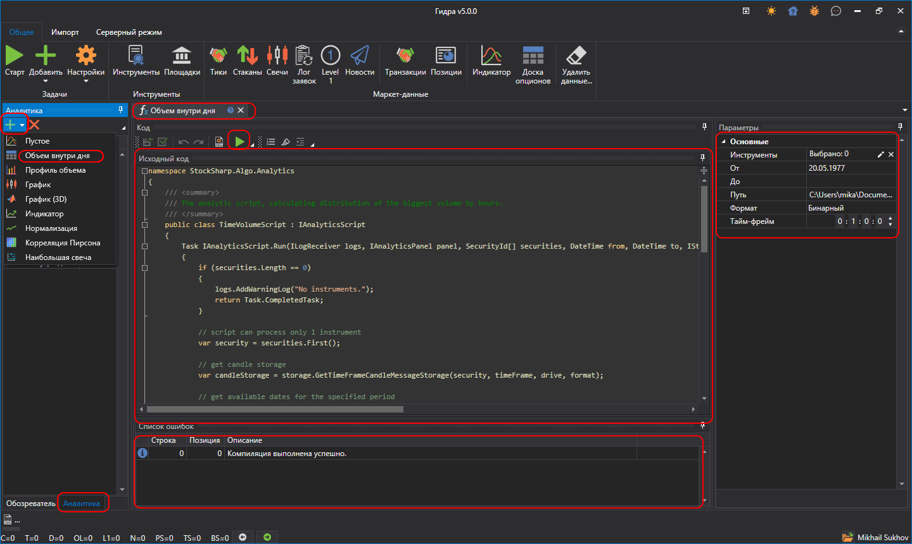
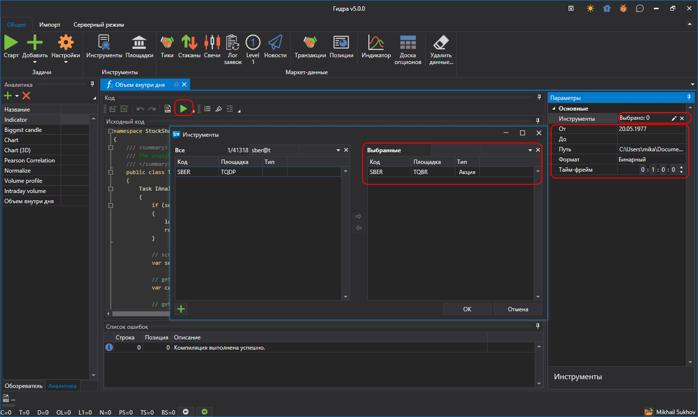

# Запуск скрипта

Чтобы создать новый скрипт для аналитики, необходимо на главном окне в панели с источниками данных выбрать закладку **Аналитики**, и в выпадающем меню выбрать интересующий шаблон для быстрого старта:

На скриншоте представлен основной интерфейс данной функции, состоящий из нескольких ключевых компонентов:

- **Дерево навигации**: Обеспечивает быстрый доступ к различным функциям аналитики к созданным скриптам аналитики, таким как анализ объёма внутри дня, профиль объёма, графики, индикаторы и другие инструменты анализа.
- **Окно кода**: Окно кода отображает исходный код выбранного аналитического скрипта. Пользователи могут напрямую редактировать код для настройки или создания аналитических расчётов и стратегий.
- **Панель параметров**: Справа расположена панель параметров, где можно задавать параметры для аналитических скриптов, включая выбор инструмента, периода анализа, путь к данным и другие настройки.
- **Список ошибок**: В нижней части интерфейса отображается список ошибок, которые были обнаружены во время компиляции или выполнения аналитического скрипта.

Скрипт аналитики оформлен ввиде класса, унаследованным от [IAnalyticsScript](xref:StockSharp.Algo.Analytics.IAnalyticsScript).

При задании параметров:

- **Инструмент** можно задать от 1 до нескольких инструментов в зависимости от логики скрипта.

- диапазон дат.
- хранилище, откуда брать данные.
- рабочий тайм-фрейм скрипта, если он его использует.

При нажатии на кнопку **Старт**  будет открыта новая закладка с отображением результатов работы скрипта.
