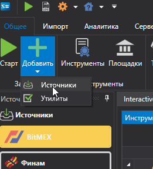
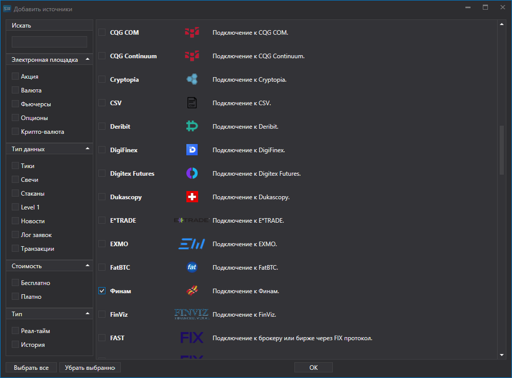
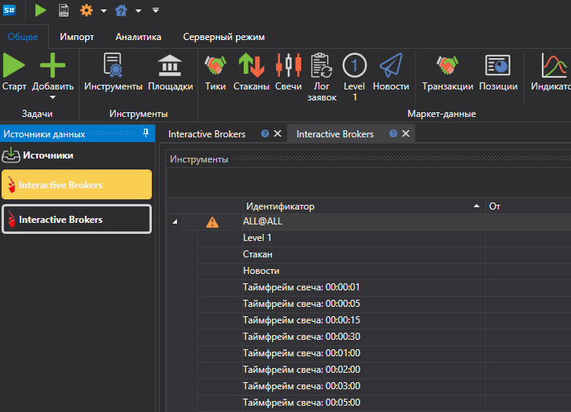
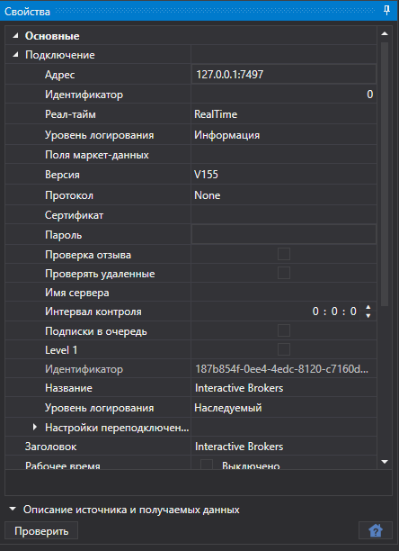

# Выбор источника данных

Чтобы добавить новый источник маркет\-данных необходимо:

- Перейти на вкладку **Общее**
- Выбрать **Добавить**
- Выбрать **Источники**

После чего появится список источников. Пользователь может выбрать сразу несколько источников. 

Также можно создать несколько экземпляров одного источника. Например, несколько экземпляров **Interactive Brokers**, которые будут сохранять скачанные данные в разные папки.

Чтобы источник после нажатия кнопки **Старт** стал скачивать данные, его нужно включить. Для этого следует выбрать значок источника на левой панели и использовать кнопку  для включения или выключения. Эту операцию можно выполнить до или после добавления инструментов для скачивания.

Ненужные источники можно удалить при помощи кнопки .

Настройки источников можно изменить в панели **Свойства**, которая расположена с правой стороны.

Общие настройки для всех источников можно посмотреть в пункте [Общие параметры подключения](common_connection_settings.md).

Каждое подключение имеет свои особенности, по ссылке ["Список коннекторов"](../data_sources.md) приведен перечень коннекторов и их настройки.

**Смотреть [видеоинструкцию](../videos/sources_samples.md)**
