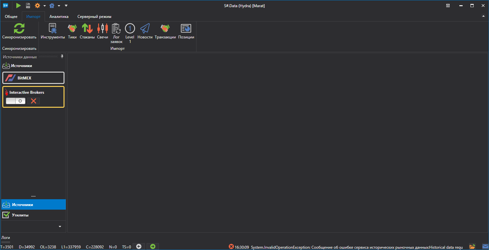

# Импорт данных

[Hydra](../hydra.md) позволяет выполнять импорт собственных данных, сохраненных в формате .csv. Для импорта нужно отрыть вкладку **Импорт**, и выбрать тип биржевых данных, который необходимо импортировать.

Можно импортировать следующие типы: 

- [Свечи](importing/candles.md)
- [Инструменты](importing/instruments.md)
- [Сделки](importing/ticks.md)
- [Стаканы](importing/order_books.md)
- [Лог заявок](importing/order_log.md)
- [Level 1](importing/level_1.md)
- [Новости](importing/news.md)
- [Свои транзакции](importing/transactions.md)

**Смотреть [видеоинструкцию](videos/import_task.md)**
