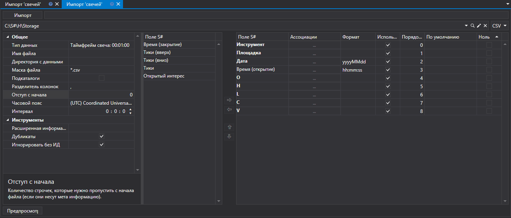
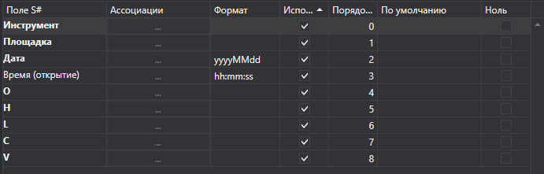
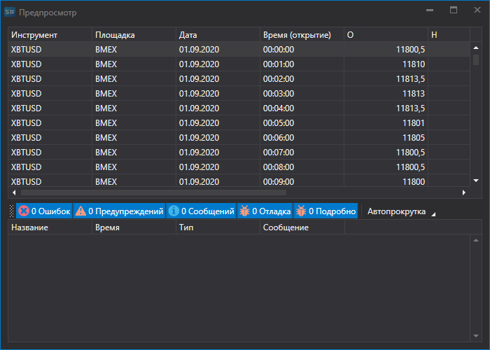

# Свечи

Для импорта свечей нужно выбрать пункт **Импорт \=\> Свечи** из главного меню приложения.



## Процесс импорта свечей

1. **Общее**.
   - **Тип данных** \- тип импортируемых данных.
   - **Имя файла** \- полный путь к CSV файлу.
   - **Директория с данными** \- папка, куда будут сохраняться конечные файлы в формате [S\#](../../api.md).
   - **Маска файла** \- маска файла, которая используется при сканировании директории. Например, candle\_\*.csv.
   - **Разделитель колонок** \- разделитель колонок. Табуляция обозначается TAB.
   - **Отступ с начала** \- количество строчек с начала файла, которые нужно пропустить (если они несут метаинформацию).
   - **Часовой пояс** \- часовой пояс.
   - **Интервал** \- периодичность обновления данных

   **Инструменты**
   - **Расширенная информация** \- сохранять расширенные импортированные поля в хранилище расширенной информации.
   - **Дубликаты** \- будут ли обновляться дубликаты инструментов, если они уже существуют.
2. **Настроить параметры импорта для полей**[S\#](../../api.md).
   - **Поле S\#** \- значение поля S\#. (**Инструмент**, **Площадка** и т.д.).
   - **Ассоциации** \- задать соответствие значения колонки в файле типу в stocksharp (если это необходимо).
   - **Формат** \- формат данных. Обычно используется при импорте значений даты и времени (см. [Сделки](ticks.md)).
   - **Использовать** \- использовать ли данные при импорте.
   - **Порядок** \- последовательность расположения столбцов свойств импортируемого элемента.

     Например, если импортируемый файл имеет следющий вид шаблона: 

     ```none
     {SecurityId.SecurityCode},{SecurityId.BoardCode},{OpenTime:yyyyMMdd},{OpenTime:default:HH:mm:ss},{OpenPrice},{HighPrice},{LowPrice},{ClosePrice},{TotalVolume}
     	  				
     ```

     То ему будет соответсвовать следющая настройка:

     Здесь:

     Значению **{SecurityId.SecurityCode}** соответствует значение **Инструмент** с порядковым номером **0**. 

     > [!TIP]
     > В программировании порядковый номер первого элемента всегда равен 0

     Значению **{SecurityId.BoardCode}** соответствует значение **Площадка** с порядковым номером **1**. И так далее. 
   - **По умолчанию** \- значение поля по умолчанию. Например, можно использовать для повторяющихся значений полей (**Инструмент**, или **Площадка** при импорте сделок, стаканов и т.п., см. [Сделки](ticks.md) ), если соответствующей информации нет в файле с данными.
   - **Ноль** \- в некоторых случаях при сохранении данных, некоторые свойства данных могут сохраняться как "0", что является ошибкой. Так например, значение цены, по различным причинам, может быть равняться 0, что не допустимо, а в дальнейшем приведет к неверному прочтению. Это может повлечь неверную работу стратегий, которые работают с ними и как следствие ошибочному результату. Устанавливая галочку, пользователь указывает, что данные в данном разделе, при равенсте 0, записываются как пустые, тоесть отсутствуют. При дальнейшей работе, например тестировании, пользователь будет видеть ошибку отсутствия данных, что будет указывать на некоректный импорт даннных. Фактически это защита пользователя от "битых" данных, для более корректной работы. 

   Пользователь может настроить большое количество свойств для скачиваемых данных. Исходя из шаблона импортируемого файла, нужно указывать свойство и присваивать ему нужный номер в последовательности. 
3. Для предварительного просмотра данных, нажать кнопку **Предпросмотр**.
4. Нажать кнопку **Импорт**.
