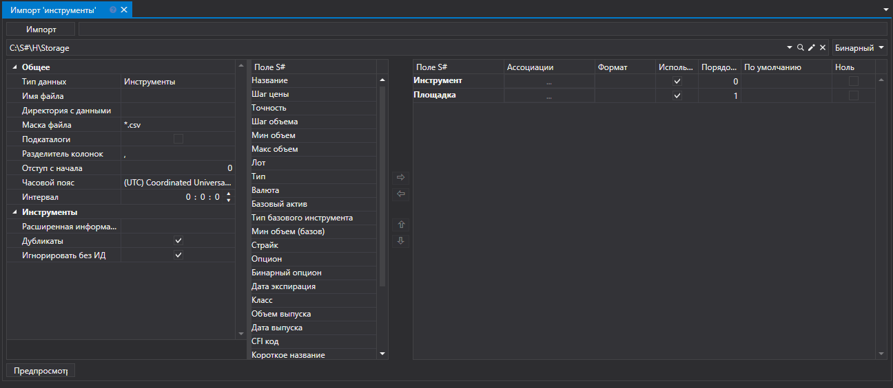
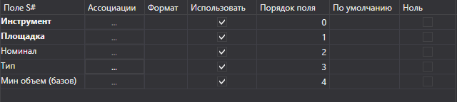
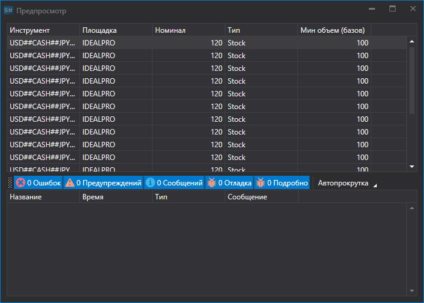

# Инструменты

Для импорта инструментов нужно выбрать вкладку **Импорт \=\> Инструменты**.



## Процесс импорта инструментов

1. **Настройки импорта**.

   См. импорт [Свечи](candles.md).
2. Настроить параметры импорта для полей [S\#](../../api.md).

   См. импорт [Свечи](candles.md).

   **Рассмотрим пример импорта инструмента из CSV файла:**
   - Файл, данные из которого необходимо импортировать, имеет следующий шаблон записи:

     ```none
     {SecurityId.SecurityCode};{SecurityId.BoardCode};{PriceStep};{SecurityType};{VolumeStep}
     	  				
     ```

     Здесь значение {SecurityId.SecurityCode} и {SecurityId.BoardCode}, соответсвуют значениям **Инструмент** и **Площадка** соответсвенно. Поэтому в поле **Порядок поля** мы присваиваем значение 0 и 1 соответсвенно.
   - Для поля {PriceStep} выбираем из окна **Поле S\#** поле **Номинал** и присваиваем ему значение 2.
   - Для поля {SecurityType} выбираем из окна **Поле S\#** поле **Тип** \- тип инструмента (акция, валюта, фьючерс и т.д.). Присваиваем ему значение 3.
   - Для поля {VolumeStep} выбираем из окна **Поле S\#** поле **Мин объем (базовый)** \- базовый или минимальный объем инсрумента. Присваиваем ему значение 4.
   - Окно настройки полей будет выглядить следующим образом:

   Пользователь может настроить большое количество свойств для скачиваемых данных. Исходя из шаблона импортируемого файла, нужно указывать свойство и присваивать ему нужный номер в последовательности. 
3. Для преварительного просмотра данных, нажать кнопку **Предпросмотр**.
4. Нажать кнопку **Импорт**.
