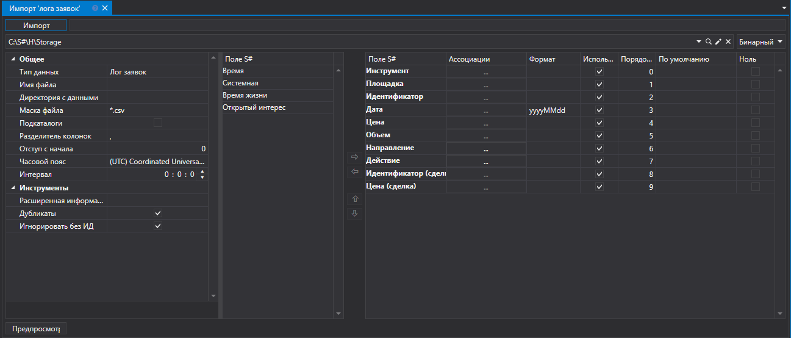
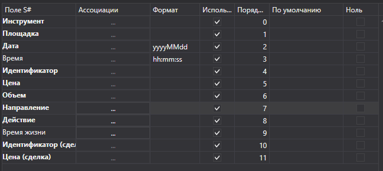
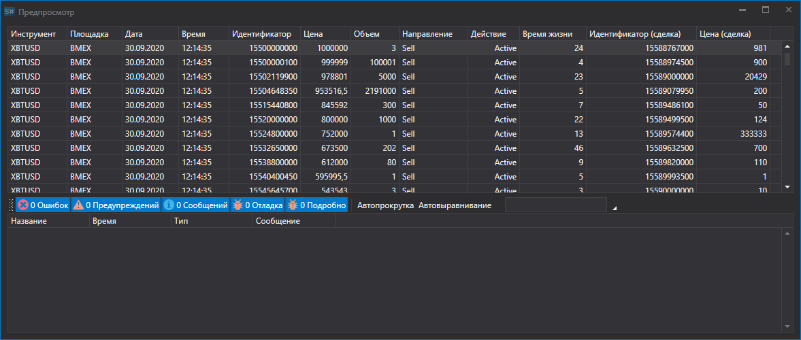

# Лог заявок

Для импорта лога заявок нужно выбрать пункт **Импорт \=\> Лог заявок** из главного меню приложения.



## Процесс импорта лога заявок

1. **Настройки импорта**.

   См. импорт [Свечи](candles.md).
2. Настроить параметры импорта для полей [S\#](../../api.md).

   См. импорт [Свечи](candles.md).

   **Рассмотрим пример импорта Лог заявок из CSV файла:**
   - Файл, данные из которого необходимо импортировать, имеет следующий шаблон записи:

     ```none
     {SecurityId.SecurityCode};{SecurityId.BoardCode};{ServerTime:default:yyyyMMdd};{ServerTime:default:HH:mm:ss.ffffff};{OrderId};{OrderPrice};{OrderVolume};{Side};{OrderState};{TimeInForce};{TradeId};{TradePrice}
     	  				
     ```

    Здесь значение {SecurityId.SecurityCode} и {SecurityId.BoardCode} соответствуют значениям **Инструмент** и **Площадка** соответственно. Поэтому в поле **Порядок поля** мы присваиваем значения 0 и 1 соответственно.
   - Для полей {ServerTime:default:yyyyMMdd} и {ServerTime:default:HH:mm:ss.ffffff} выбираем из окна **Поле S\#** поля **Дата** и **Время** соответственно. Присваиваем значения 2 и 3.
   - Для поля {OrderId} выбираем из окна **Поле S\#** поле **Идентификатор** \- идентификатор заявки. Присваиваем ему значение 4.
   - Для поля {OrderPrice} выбираем из окна **Поле S\#** поле **Цена** \- цена заявки. Присваиваем ему значение 5.
   - Для поля {OrderVolume} выбираем из окна **Поле S\#** поле **Объем** \- объем заявки. Присваиваем ему значение 6.
   - Для поля {Side} выбираем из окна **Поле S\#** поле **Направление** \- направление заявки (покупка или продажа). Присваиваем ему значение 7.
   - Для поля {OrderState} выбираем из окна **Поле S\#** поле **Действие** \- состояние заявки (активна, неактивна или ошибка). Присваиваем ему значение 8.
   - Для поля {TimeInForce} выбираем из окна **Поле S\#** поле **Время жизни** \- условие исполнения лимитированной заявки. Присваиваем ему значение 9.
   - Для поля {TradeId} выбираем из окна **Поле S\#** поле **Идентификатор (сделки)** \- идентификатор сделки. Присваиваем ему значение 10.
   - Для поля {TradePrice} выбираем из окна **Поле S\#** поле **Цена (сделки)** \- цена сделки. Присваиваем ему значение 11.
   - Окно настройки полей будет выглядить следующим образом:

   Пользователь может настроить большое количество свойств для скачиваемых данных. Исходя из шаблона импортируемого файла, нужно указывать свойство и присваивать ему нужный номер в последовательности. 
3. Для предварительного просмотра данных нажать кнопку **Предпросмотр**.
4. Нажать кнопку **Импорт**.
