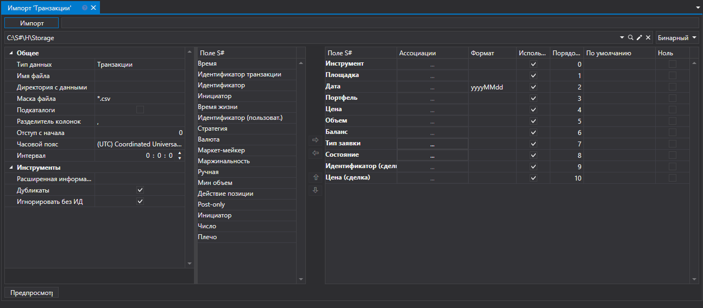

# Транзакции

Для импорта своих транзакций нужно выбрать пункт **Импорт \=\> Свои транзакции** из главного меню приложения.

## Процесс импорта своих транзакций

1. Выполнить **Настройки импорта из CSV**.

   См. импорт [Свечи](candles.md).
2. Настроить параметры импорта для полей [S\#](../../api.md).

   См. импорт [Свечи](candles.md).
3. Для предварительного просмотра данных, нажать кнопку **Предпросмотр**.
4. Нажать кнопку **Импорт**.
