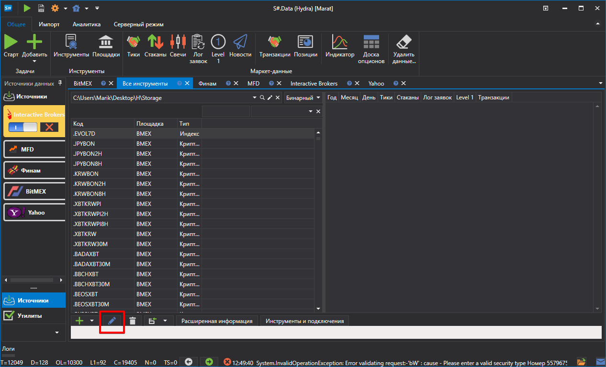
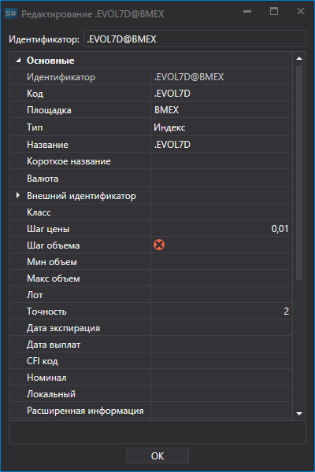
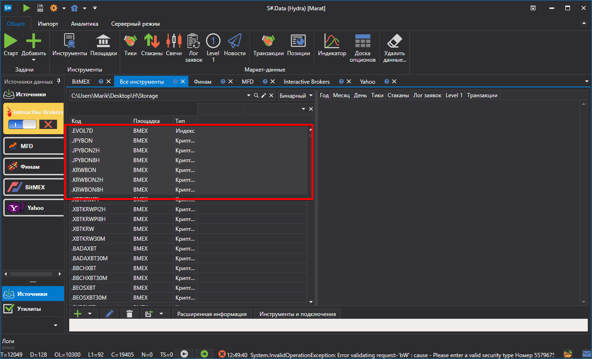
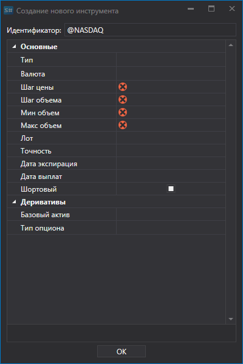

# Редактирование инструментов

Чтобы отредактировать инструмент (например, когда инструмент был заполнен не всеми необходимыми данными), надо двойным кликом мышкой по инструменту или нажатием на кнопку  открыть окно, в котором произвести необходимые настройки:

Переходим в окно **Инструменты**.

После чего откроется окно для редактирования.

При необходимости, можно отредактировать группу инструментов. Для этого надо выбрать группу инструментов и нажать на кнопку . 

После чего можно редактировать группу.

Если у выбранной группы инструментов есть одинаковые значения, то это поле будет заполнено данным значением. Если значения разные, то это поле будет пустым. Например, выбрано два инструмента, у которых значение "Шаг цены" равно 1, у одного инструмента размер лота 10, у другого – 100. Соответственно, в поле "Шаг цены" будет 1, а поле "Шаг объема" будет пустое. 
