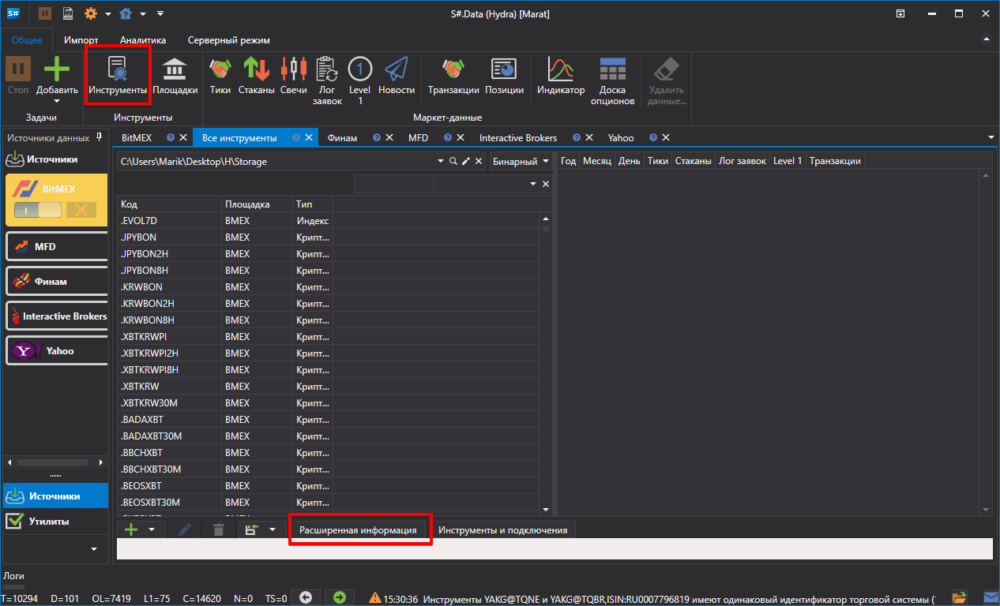
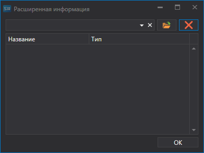

# Расширенная информация

Источниками расширенной информации по инструментам являются **CSV** файлы, расположенные в папке "c:\\Users\\Users\\Documents\\StockSharp\\Hydra\\Extended info\\", которые автоматически загружаются при загрузке [Hydra](../../hydra.md).

Расширенной информацией может являться любая необходимая информация по инструменту (например, страна, город, сайт и др.). 

Каждый источник расширенной информации (**CSV** файл) содержит список инструментов и свойств расширенной информации, имеющихся в источнике для каждого из инструментов. Для каждого источника расширенной информации, расширенная информация будет уникальной.

Если в источнике нет расширенной информации по инструменту, то в колонках соответствующих расширенной информации, списка всех инструментов, будут отображаться пустые ячейки.

Для выбора необходимой расширенной информации, нужно:

1. на вкладке **Инструменты** нажать на кнопку **Расширенная информация** 
2. После чего появится окно, в котором необходимо выбрать путь к нужному CSV файлу.

Ниже представлен пример **CSV** файла расширенной информации открытый в разных редакторах **MS Excel** и **NotePad**

