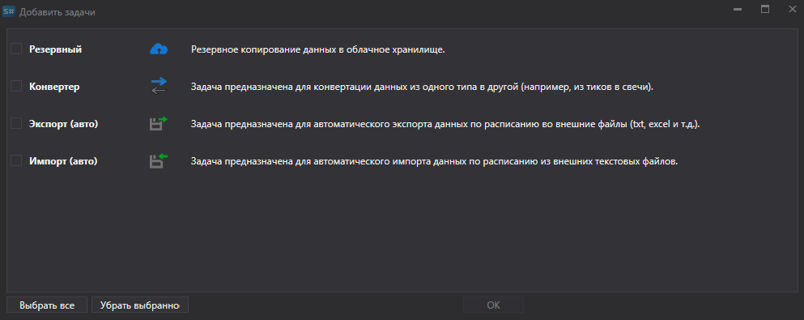
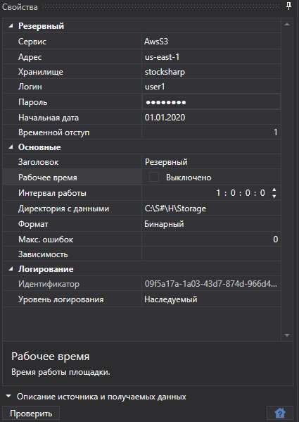

# Создание и настройка задачи

Далее описано создание и настройка задачи резервного копирования.

1. Для создания задачи необходимо щелкнуть по кнопке **Добавить задачи...**, в открывшемся окне отметить пункт **Резервный** и нажать кнопку **ОК**.
2. Далее следует настроить задачу.

   **Резервный**
   - **Адрес** \- адрес сервиса. 
   - **Адрес** \- адрес региона. Адрес региона, указанного в настройках бакета. См. [Regions and Endpoints](https://docs.aws.amazon.com/general/latest/gr/rande.html#s3_region). 
   - **Хранилище** \- имя бакета. 
   - **Логин** \- логин. Ключ доступа **Access Key ID**. 
   - **Пароль** \- пароль. Ключ доступа **Secret Access Key**. 
   - **Начальная дата** \- с какой даты начать резервное копирование. 
   - **Временной отступ** \- отступ в днях от текущей даты. 

   **Основные**
   - **Заголовок** \- заголовок задачи. 
   - **Рабочее время** \- время начала работы задачи. При установке галочки в поле, появляется возможность настроить расписание работы площадки.
   - **Интервал работы** \- интервал работы задачи. 
   - **Директория с данными** \- директория с данными, для которых выполняется резервное копирование. 
   - **Формат** \- формат данных: BIN\/CSV. 
   - **Макс. ошибок** \- максимальное количество ошибок, при достижении которого задача будет остановлена. По умолчанию 0 \- количество ошибок игнорируется.
   - **Зависимость** \- задача, которая должна быть выполнена перед запуском текущей. 

   **Логирование**
   - **Идентификатор** \- идентификатор. 
   - **Уровень логирования** \- уровень логирования. 
3. После настройки задачи нужно добавить инструменты, которые должны сохраняться в резервном хранилище, и нажать кнопку **Старт**.

## См. также

[Создание и настройка аккаунта](setup.md)
