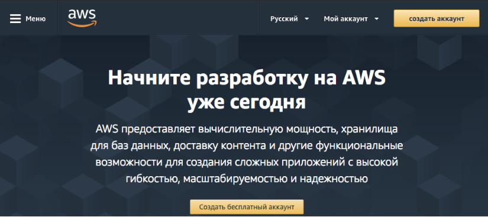
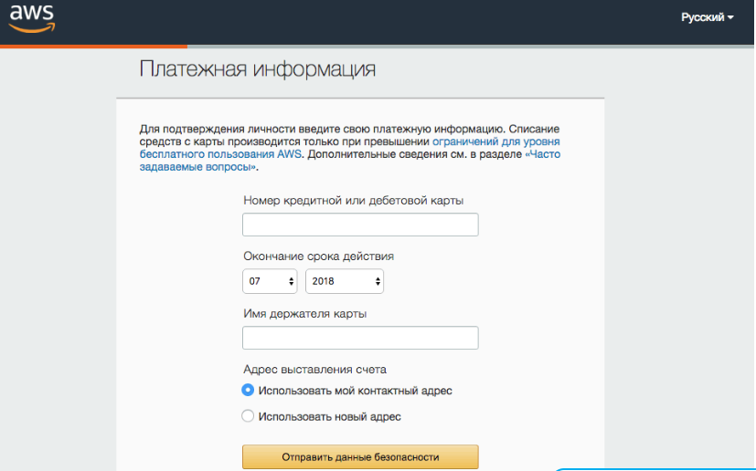
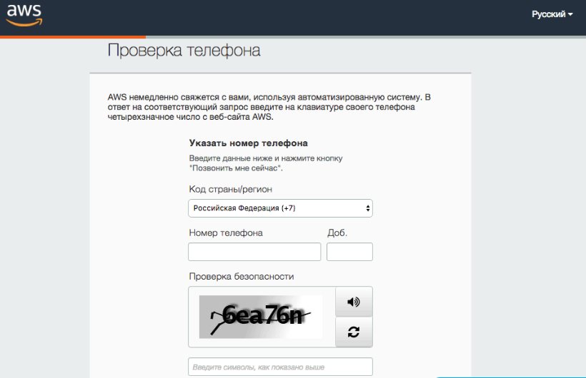
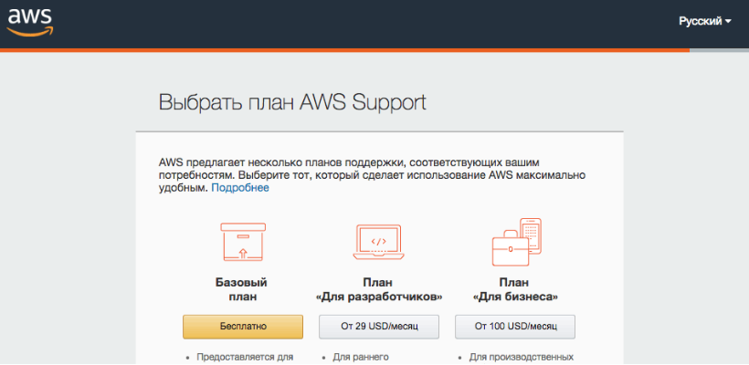

# Создание и настройка аккаунта

Далее описано создание и настройка аккаунта AWS.

1. Для создания аккаунта AWS необходимо перейти на страницу [Создать аккаунт AWS](https://aws.amazon.com/ru/) и щелкнуть по кнопке **Создать аккаунт**.
2. Далее заполнить формы, которые будет предлагать веб\-сервис.
3. Заполнить данные вашей карты, это делается для подтверждения личности.
4. На одном из этапов регистрации будет предложено ввести номер телефона и инициировать звонок на Ваш телефон при помощи кнопки **Call Me Now**.

   Вам следует поднять трубку и набрать на телефоне код, который будет показан на экране компьютера.
5. Далее будет предложено выбрать план поддержки. По завершению создания аккаунта нужно перейти в консоль управления.
6. Первой операцией при настройке аккаунта является создание Bucket.

   Bucket \- это контейнер для хранения объектов в "облаке". Для Bucket необходимо задать уникальное имя, а также выбрать региональный дата\-центр (Region), где физически хранятся данные. Обратите внимание, в дальнейшем при настройке задачи резервного копирования: 1) в поле **Хранилище** нужно будет ввести имя бакета, 2) в поле **Адрес** нужно использовать не имя, а адрес регионального дата центра, который можно узнать [здесь](https://docs.aws.amazon.com/general/latest/gr/rande.html#s3_region). После чего продолжить настройку.
7. Далее необходимо задать ключи для программного доступа к сервисам AWS. Для этого в консоли AWS нужно перейти по ссылке **Security Credentials**.
8. Раскрываем заголовок **Access Keys (Access Key ID and Secret Access Key)** и создаем ключи доступа при помощи кнопки .

   Созданные ключи можно сохранить в файл при помощи кнопки **Download Key File**.

   Обратите внимание, что при настройке задачи резервного копирования **Access Key ID** должен использоваться в качестве логина, а **Secret Access Key** в качестве пароля.

## См. также

[Создание и настройка задачи](hydra_settings.md)
