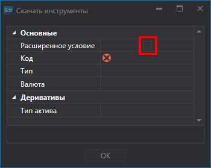
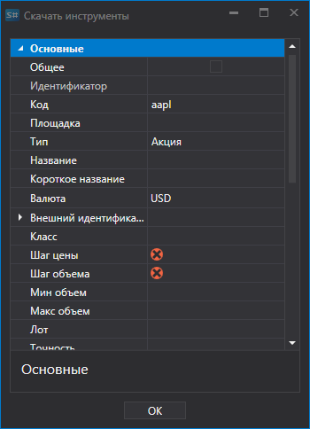
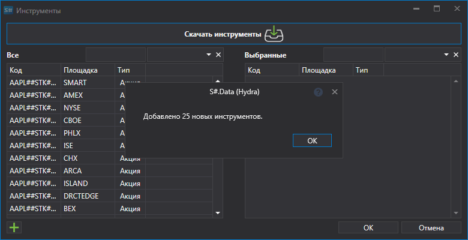
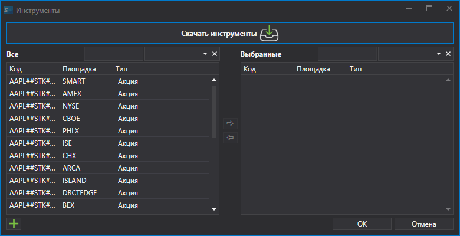
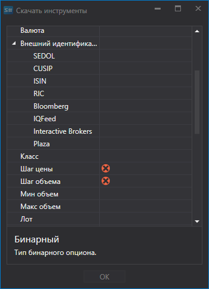
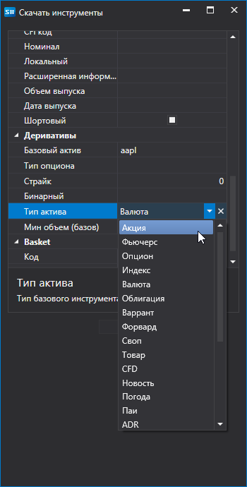

# Настройка инструмента для скачивания

Настройка инструмента для скачивания.

Для ряда источников существует возможность сделать настройки для скачивания нужных инструментов.

Рассмотрим на примере скачивания инструментов с источника **Interactive Brokers**: 

1. Выбираем скачать инструменты и нажимаем на кнопку **Расширенное условие**.
2. После этого раскроется список расширенных настроек для скачиваемого инструмента.
3. Нужно скачать инструмент, отвечающий следующим параметрам: акция компании APPLE, валюта \- Доллар США. Для этого мы выставляем параметры инструмента, как показано ниже, и нажимаем **OK**.

   После этого программа [Hydra](../../hydra.md) скачает все инструменты отвечающие установленным параметрам. 

Настройка позволяет пользователю выбрать различные параметры для загружаемого инструмента.

Так, например, пользователь может выбрать:

- **Шаг цены и объема**
- **Минимальный и максимальный объемы**
- **Внешний идентификатор** 
- Для опционов позволяет настроить **Базовый актив** и **Тип актива** (тип базового инструмента).

**Смотреть [видеоинструкцию](../videos/instruments_downloading.md)**
