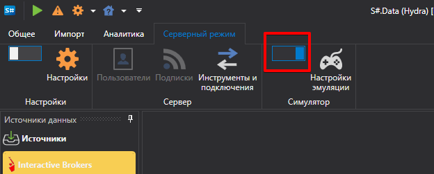
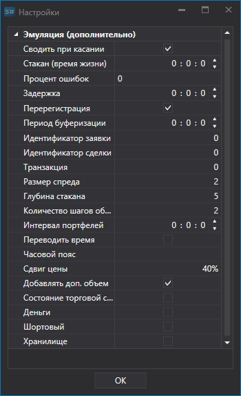

# Настройки эмуляции

В серверном режиме программа позволяет включить режим эмуляции.

В режиме эмуляции программа [Hydra](../../hydra.md) позволяет выполнять следующие функции:

- Программа позволяет настроить ключи подключения к источнику и одновременно работать с одним подключением в разных программах ([Designer](../../designer.md), [Terminal](../../terminal.md)). 
- Если источник маркет данных позволяет скачивать исторические данные, то их можно использовать одновременно для тестирования.
- Если источник позволяет получать данные в режиме реального времени, то режим эмуляции позволяет эмулировать режим торгов. В таком режиме данные о действиях пользователя (выставление заявок, сделки) передаются непосредственно в [Hydra](../../hydra.md), при этом для каждой программы действия фиксируются отдельно. Например при выставлении заявки в Terminal, изменения по ней будут видны только для нее, а в Designer не будут фиксироваться. Это позволяет избегать конфликтов между двумя программами работающими через одно подключение. 
- ВАЖНО\! Проводимые сделки в режиме эмуляции торги и операции на них эмулируются в режиме реального времени, при выключенном режиме, действия будут совершаться на реальных торгах.

Этот режим используется при [тестировании стратегий](../../shell/user_interface/emulation.md).

## Настройки эмуляции.

- **Сводить при касании** \- при эмулировании сведения по сделкам, производить сведение заявок, когда цена сделки равна цене заявки.
- **Стакан (время жизни)** \- максимальный срок стакана в эмуляторе. Если за установленный период не произошло обновление стакана, то его значение стирается. Используется чтобы убрать старые данные стаканов, если имеются "дыры" в данных.
- **Процент ошибок** \- процент ошибок регистрации новых заявок (от 0 до 100).
- **Задержка** \- минимальная задержка выставляемых заявок.
- **Перерегистрация** \- будет ли поддерживаться перерегистрация заявок в виде одной транзакции.
- **Период буферизации** \- параметр отвечающий за период отправки целых пакетов, с целью эмулирования сетевой задержки и буферизации работы биржевого ядра.
- **Идентификатор заявки** \- число, с которого эмулятор будет генерировать идентификаторы для заявок.
- **Идентификатор сделки** \- число, с которого эмулятор будет генерировать идентификаторы для сделок.
- **Транзакция** \- число, с которого эмулятор будет генерировать идентификаторы для транзакций заявок.
- **Размер спреда** \- размер спреда в шагах цены. Применяется для определения спреда при генерации стакана из тиковых сделок.
- **Глубина стакана** \- максимальная глубина стакана, генерируемого тиками. 
- **Количество шагов объема** \- количество шагов объема, на которое заявка больше тиковой сделке. Применяется в тестировании на тиковых сделках.
- **Интервал портфелей** \- интервал перерасчета данных по портфелям. Если интервал равен 0, то перерасчет не выполняется.
- **Переводить время** \- переводить время для заявок и сделок в биржевое.
- **Часовой пояс** \- информация о часовом поясе, где находится биржа.
- **Сдвиг цены** \- сдвиг цены от последней сделки, определяющий границы максимальной и минимальной цен на следующую сессию.
- **Добавить дополнительный объем** \- добавлять дополнительный объем в стакан при выставлении заявок с большим объемом. 
- **Состояние торговой сессии** \- проверка торгового состояния. 
- **Деньги** \- проверять денежный баланс. 
- **Шортовый** \- возможность открывать шортовые позиции. 
- **Хранилище** \- хранилище.
