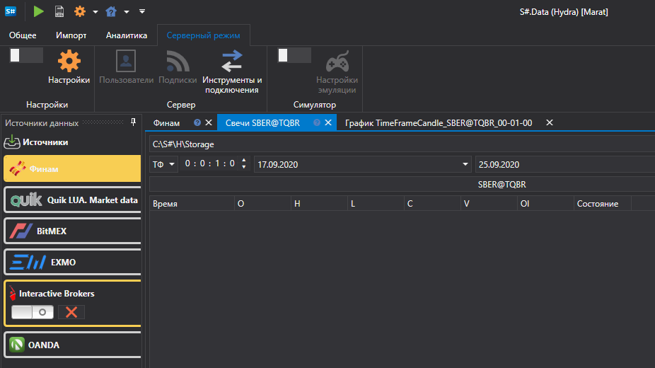
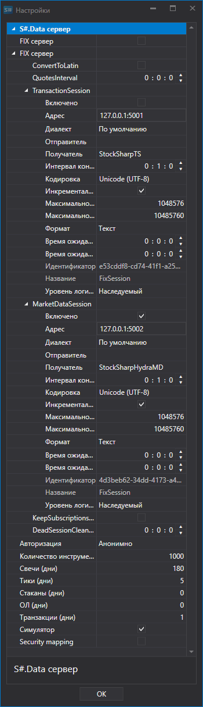
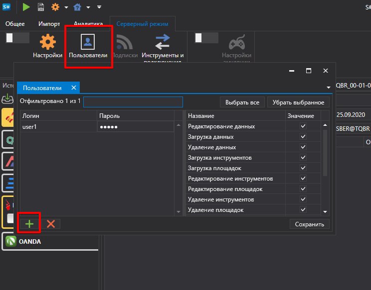

# Настройки

[Hydra](../../hydra.md) может использоваться в серверном режиме, в данном режиме можно удаленно подключиться к [Hydra](../../hydra.md) и получить имеющиеся данные в хранилище. К [Hydra](../../hydra.md), работающей в серверном режиме, можно подключиться из [Designer](../../designer.md) (как это сделать описано в пункте [Создание хранилища исторических данных](../../designer/market_data_storage/getting_started.md) документации по [Designer](../../designer.md)). Также к [Hydra](../../hydra.md) можно подключиться через [API](../../api.md) (как это сделать описано в пунктах [Подключение через FIX протокол](fix_fast_connectivity.md)).

В серверном режиме программа [Hydra](../../hydra.md) позволяет пользователю работать, используя одно подключение, сразу с несколькими программами. Путем настройки ключа доступа в настройках программы, пользователь может одновременно работать с одним источником под одной учетной записью.

Фактически подключение к источнику происходит через Hydra, к которой одновременно подключаются, например, [Designer](../../designer.md), [Terminal](../../terminal.md). Такой метод позволяет избежать переподключений между программами, покупку дополнительного подключения. При такой работе, исключаются конфликты, возникновение которых обусловлено выставлением заявок или сделок с различных программ. Hydra получает сигнал и передает обратно результат той программе от которой он получен, при этом последовательность работы других программ не нарушается.

Для включения серверного режима [Hydra](../../hydra.md) необходимо в верхнем меню программы выбрать вкладку **Серверный режим**.

После этого нажимаем кнопку **Настройки**, откроется окно настройки серверного режима.

**Hydra-сервер**

- **FIX сервер** \- перевести [Hydra](../../hydra.md) в серверный режим, распространяющего live торговлю и исторические данные через FIX протокол. 

  В данном разделе настроек пользователь настраивает подключение для работы с источниками: 
  1. **ConvertToLatin** \- конвертировать кириллицу в латиницу 
  2. **QuotesInterval** \- период обновления котировок 
  3. **TransactionSession** \- настройка торговой сессии. Настройка для торговли через программу Hydra. 

     Настройка включает в себя возможность настроить: Диалект FIX протокола, Отправителя и Получателя, Формат данных и другие настройки. Подробнее см. [свойства FIXServer.](https://doc.stocksharp.ru/html/Properties_T_StockSharp_Fix_FixServer.htm)
  4. **MarketDataSession** \- настройки передачи маркет\-данных, получаемых при помощи Hydra. Подробнее см. [свойства FIXServer.](https://doc.stocksharp.ru/html/Properties_T_StockSharp_Fix_FixServer.htm)
  5. **KeepSubscriptionsOnDisconnect** \- сохранение подписок при отключении от источника. 
  6. **DeadSessionCleanupInterval** \- через какой интервал времени произойдет очистка информации, если соединение будет отключено.
- **Авторизация** \- авторизация для получения доступа к Hydra-сервер 
- **Количество инструментов** \- максимальное количество инструментов, которое можно запрашивать с сервера 
- **Свечи (дни)** \- максимальное количество дней, доступных для загрузки истории свечей 
- **Тики (дни)** \- максимальное количество дней, доступных для загрузки истории тиковых данных 
- **Стаканы (дни)** \- максимальное количество дней, доступных для загрузки истории стаканов 
- **ОЛ (дни)** \- максимальное количество дней, доступных для загрузки истории ОЛ данных 
- **Транзакции (дни)** \- максимальное количество дней, доступных для загрузки истории транзакций 
- **Симулятор** \- включение режима симулятора 
- **Security mapping** \- включить режим передачи только указанных инструментов. 

Если установить **Авторизацию** отличную от **Анонимно**, на вкладке **Общее** появится кнопка **Пользователи**, после нажатия на которую появляется окно **Пользователи**

В левой части окна можно добавить нового пользователя, а в правой установить для него права доступа.
