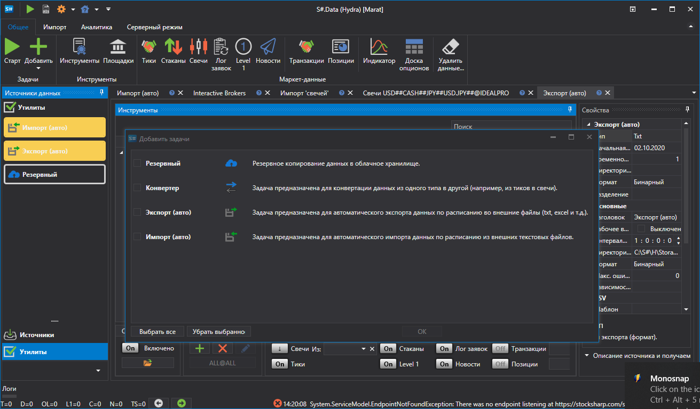

# Утилиты

Утилита \- повторяющееся действие в определенное время.

Для того чтобы просмотреть список утилит, необходимо в левой панели выбрать пункт **Утилиты**. Работа с утилитами идет точно также как и с источниками \- утилиту можно добавит, удалить, редактировать, включить\/выключить. Для добавления **Утилиты** необходимо на вкладке **Общая** выбрать **Добавить\=\>Утилиты**. Появится соответсвующее окно, на котором можно выбрать необходимую **Утилиту**. 

На текущий момент в [Hydra](../hydra.md) существуют четыре класса задач:

- [Бэкап данных ("Резервный")](misc/backup.md) \- задача предназначена для резервного копирования данных в облачный сервис. 
- [Конвертер](tasks/converter.md) \- задача предназначена для конвертации биржевых данных в тики, свечи или стаканы. 
- [Экспорт (авто)](tasks/export_auto.md) \- задача предназначена для экспорта свечей в различные форматы. 
- [Импорт (авто)](tasks/import_auto.md) \- задача предназначена для автоматического импорта маркет данных по заданным шаблонам. 
