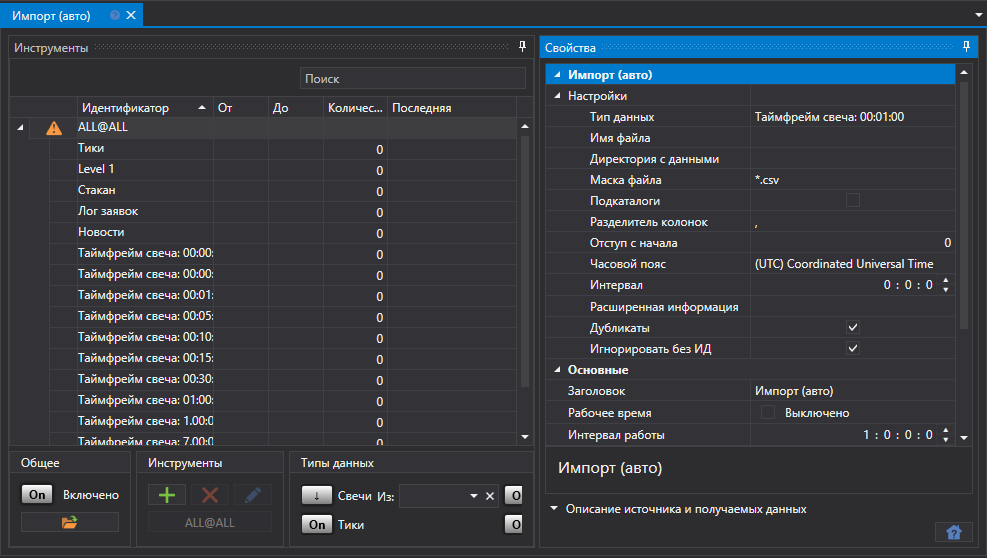
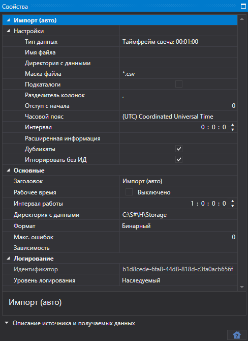
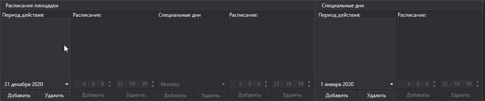

# Импорт (авто)

Задача выполняет автоматический импорт биржевых данных из файлов в указанном каталоге по заданной маске файла.

Для каждого выбранного типа маркет\-данных, шаблон настраивается во вкладке [Импорт данных](../importing.md).

В нижней части панели можно выбрать инструменты, по которым будут импортироваться данные, а также тип данных для импорта.

Для каждого инструмента можно указать следующие свойства импорта данных:

**Импорт (авто)**

**Настройки**

- **Тип данных** \- тип импортируемых данных. 
- **Имя файла** \- полный путь к файлу. 
- **Директория с данными** \- директория с данными. 
- **Маска файла** \- маска файла, которая используется при сканировании директории. Например, candles\*.csv. 
- **Подкаталоги** \- включать подкаталоги. 
- **Разделитель колонок** \- разделитель колонок. Табуляция обозначается TAB. 
- **Отступ с начала** \- количество строчек, которые нужно пропустить с начала файла (если они несут метаинформацию). 
- **Часовой пояс** \- часовой пояс. 
- **Интервал** \- периодичность обновления данных. 
- **Расширенная информация** \- сохранить расширенные импортированные поля в хранилище расширенной информации. 
- **Дубликаты** \- нужно ли обновлять дубликаты инструментов, если они уже существуют. 
- **Игнорировать без ИД** \- игнорировать инструменты без идентификатора. 

**Основные**

- **Заголовок** \- заголовок задачи. 
- **Рабочее время** \- настройка работы площадки. 
- **Интервал работы** \- интервал работы. 
- **Директория с данными** \- директория с данными, куда будут сохраняться конечные файлы в формате [S\#](../../api.md). 
- **Формат** \- формат данных: BIN\/CSV. 
- **Макс. ошибок** \- максимальное количество ошибок, по достижению которого задача будет остановлена. По умолчанию 0 \- количество ошибок игнорируется. 
- **Зависимость** \- задача, которая должна быть выполнена перед запуском текущей. 

**Логирование**

- **Идентификатор** \- идентификатор. 
- **Уровень логирования** \- уровень логирования. 
