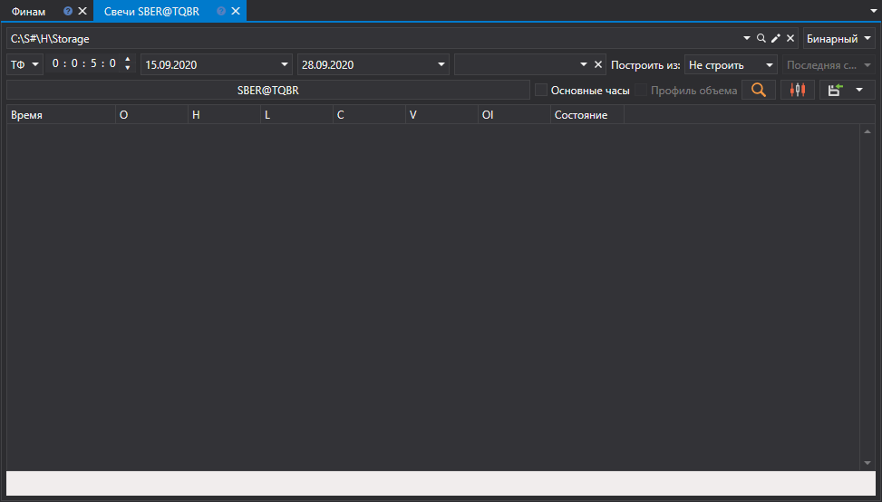
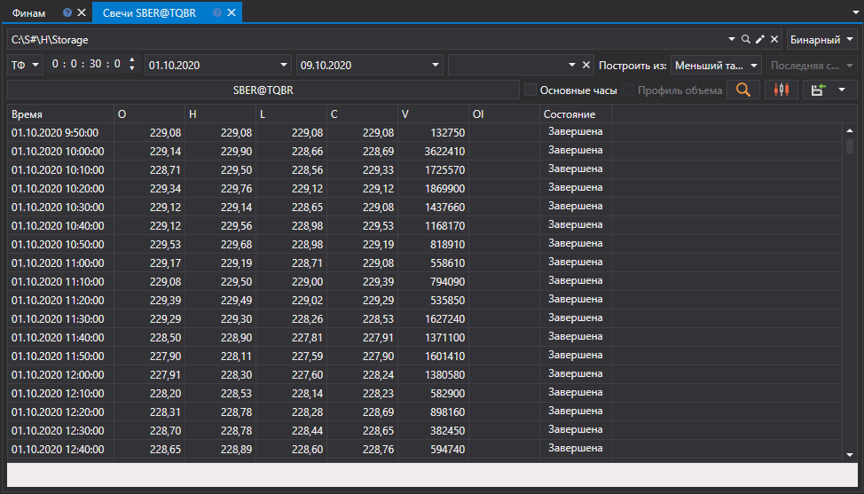
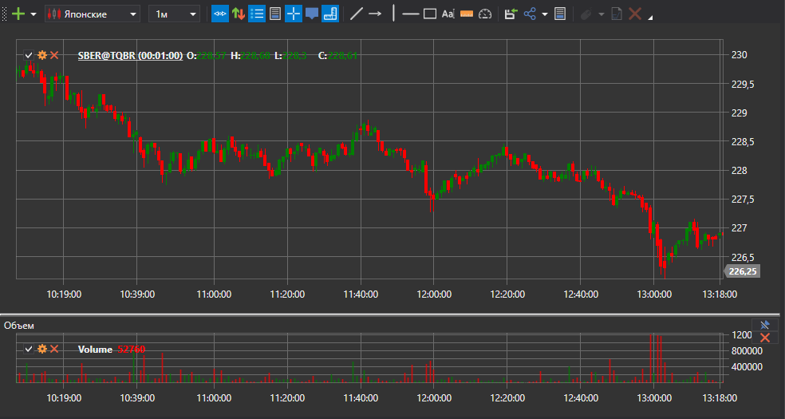

# Генерация свечей

[Hydra](../../hydra.md) позволяет на основе скачанных сделок формировать свечи различных типов, которые впоследствии можно экспортировать в форматы [Excel](https://ru.wikipedia.org/wiki/Excel), XML, SQL, BIN, JSON или TXT.

Это позволяет использовать сгенерированные данные в любых программах технического анализа (WealthLab, AmiBroker и т.д.).

## Процесс генерации свечей

1. На вкладке **Общее** нажмите кнопку **Свечи**, откроется следующее окно:

   

2. В открывшемся окне необходимо настроить параметры генерации свечей:

   - Выберите из выпадающего списка интересующий тип свечи (поддерживаются все [стандартные типы свечей](../../api/candles.md))
   - Укажите нужные параметры для выбранного типа свечей:
     - Для [TimeFrameCandleMessage](xref:StockSharp.Messages.TimeFrameCandleMessage) - выберите **Таймфрейм**
     - Для [VolumeCandleMessage](xref:StockSharp.Messages.VolumeCandleMessage) - укажите **Объем**
     - Для [TickCandleMessage](xref:StockSharp.Messages.TickCandleMessage) - укажите **Количество тиков**
     - Для [RangeCandleMessage](xref:StockSharp.Messages.RangeCandleMessage) - укажите **Диапазон**
     - Для [RenkoCandleMessage](xref:StockSharp.Messages.RenkoCandleMessage) - укажите **Размер блока**
     - Для [PnFCandleMessage](xref:StockSharp.Messages.PnFCandleMessage) - укажите **Параметры P&F**
   - Выберите инструмент, для которого будут генерироваться свечи
   - Укажите временной диапазон (при необходимости)
   - Нажмите на кнопку  для запуска генерации

### Пример генерации свечей по таймфрейму

Для генерации 5-минутных свечей для инструмента SBER@TQBR:

1. Выберите тип свечи [TimeFrameCandleMessage](xref:StockSharp.Messages.TimeFrameCandleMessage)
2. Установите **Таймфрейм** = 5 мин
3. Выберите инструмент SBER@TQBR
4. Нажмите кнопку поиска

После генерации данных вы увидите результат:

### Пример генерации свечей по объему

Для генерации объемных свечей:

1. Выберите тип свечи [VolumeCandleMessage](xref:StockSharp.Messages.VolumeCandleMessage)
2. Укажите объем (например, 100)
3. Выберите инструмент
4. В поле **Построить из** выберите **Тики**
5. Нажмите кнопку поиска

Результат генерации:

## Источники данных для построения свечей

Если маркет-данные не удалось получить напрямую из источника, можно сгенерировать свечи, выбрав в поле [**Построить из**](any_market_data_types.md) тип данных, из которых они будут построены:

- **Тики** - построение свечей из тиковых данных
- **Стаканы** - построение свечей из данных стаканов
- **Level1** - построение свечей из данных Level1
- **Меньший Таймфрейм** - построение свечей с большим таймфреймом из свечей с меньшим

### Примеры различных вариантов построения:

- Свечи с таймфреймом 10 минут из тиков:

  

- Свечи с таймфреймом 30 минут из 5-минутных свечей:

  

> [!TIP]
> Если в поле **Построить из** выбрать **не строить**, то будет произведен поиск только готовых свечей, которые были скачаны напрямую через источник данных.

## Визуализация сгенерированных свечей

Для графического отображения сгенерированных свечей:

1. Нажмите на кнопку 
2. Откроется график с построенными свечами:

   

   

## Добавление индикаторов на график

К графику свечей можно добавить технические индикаторы:

1. Откройте контекстное меню, щелкнув правой кнопкой мыши по панели графика
2. Выберите пункт **Индикатор** и необходимый индикатор из списка
3. Для вывода индикатора на отдельной панели:
   - Добавьте новую панель при помощи кнопки 
   - Выберите необходимый индикатор из контекстного меню

Пример графика с добавленными индикаторами:

## Экспорт данных

Полученные значения свечей можно [экспортировать в различные форматы](export_data.md) для использования в других программах.

**Смотрите также [видеоинструкцию](../videos/building_candles.md) по построению свечей различных типов**