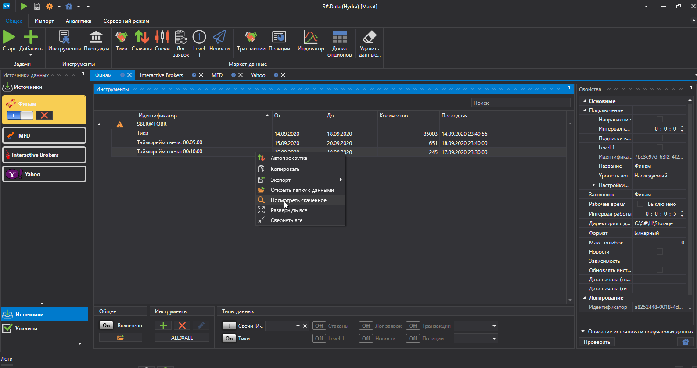
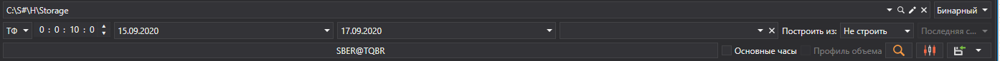
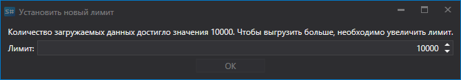
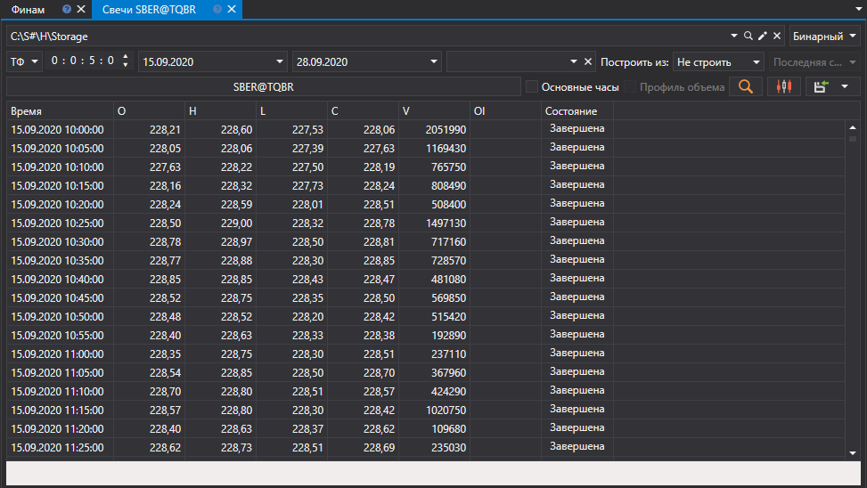
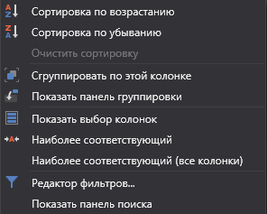

# Просмотр маркет\-данных

Полученные данные [Hydra](../../hydra.md) можно просмотреть в специальных панелях. 

Для этого на вкладке **Общее** необходимо нажать на одну из следующих кнопок: [Тики](view_and_export/ticks.md), [Стаканы](view_and_export/order_books.md), [Свечи](candles_generation.md), [Лог заявок](view_and_export/order_log.md), [Level 1](view_and_export/level_1_.md), [Новости](view_and_export/news.md), [Транзакции](view_and_export/transactions.md), [Доска опционов](view_and_export/option_desk.md), [Индикаторы](view_and_export/indicators.md), [Позиции](view_and_export/positions.md). 

Или нажать правой кнопкой мыши на необходимом типе данных, как показано на рисунке, а так же два раза щелкнув на необходимом типе данных.

Каждая панель имеет общий интерфейс настроек следующего вида:

- В верхней строке указывается хранилище маркет\-данных и их формат (BIN или CSV).
- В нижней строке устанавливается период, за который будут запрошены данные. При нажатии на кнопку **Выберите инструмент** появится окно выбора инструментов, в котором можно выбрать один или несколько инструментов. Если будут выбраны несколько инструментов, то при последующем экспорте в Excel или CSV программа сама отсортирует данные разных инструментов по разным файлам. 
- Если при построении таблицы с данными количество загружаемых данных будет превышать установленный лимит, то на экране появиться окно:

  Нужно увеличить лимит загружаемых данных.
- Если данные были получены из источников, чей часовой пояс не совпадает с текущим часовым поясом, то можно настроить временной пояс. Тогда, после построения, полученные данные будут иметь время выбранного пользователем пояса. 
- Так как ряд источников не предоставляет возможность скачать некоторые данные, в программе предусмотрено поле ["Построить из"](any_market_data_types.md). Используя данное поле, пользователь получает возможность строить маркет\-данные из маркет\-данных другого типа. Эта же функция может быть применена для построения маркет\-данных без дополнительного скачивания, используя за основу уже имеющиеся данные. 
- После того как выбраны указанные выше параметры, необходимо нажать на кнопку .

При помощи контекстного меню можно настроить различные параметры таблицы значений маркет\-данных: группировку строк, доступные колонки, формат отображения и др.

