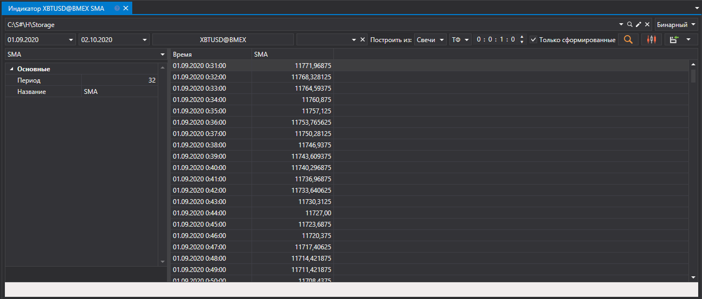
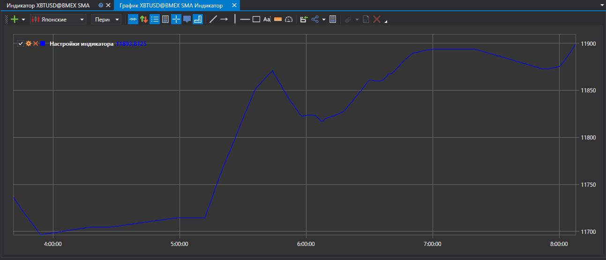

# Индикаторы

В появившейся панели выбрать инструмент, интересуемый диапазон времени, указать тип данных, из которых будет строиться индикатор, задать [индикатор](../../../api/indicators/list_of_indicators.md) и его параметры, после чего нажать кнопку :

Для просмотра графика значений достаточно нажать на кнопку .

Полученные значения индикатора можно [экспортировать в нужный формат](../export_data.md).
