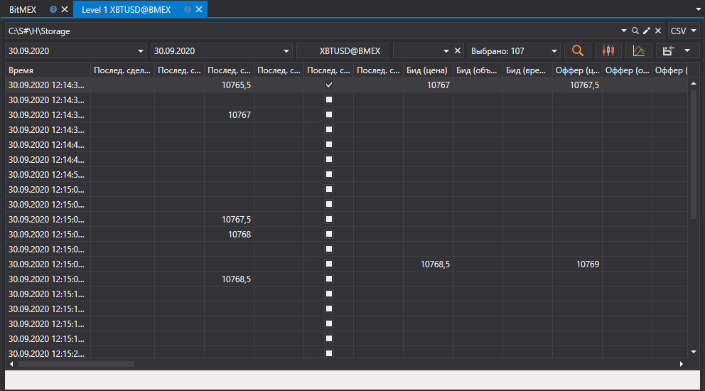
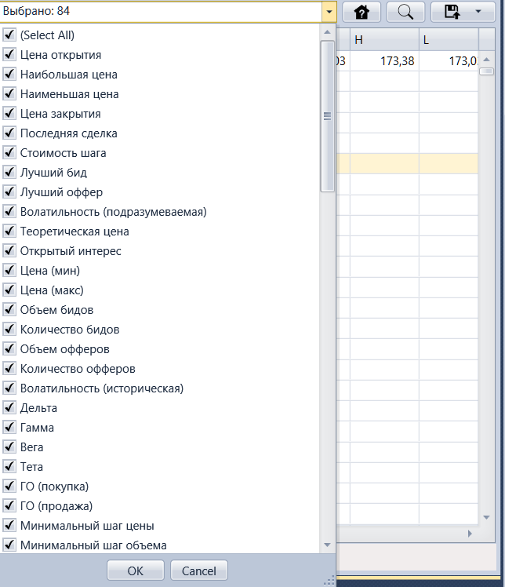

# Level 1 

В появившемся окне выбрать интересуемый диапазон времени, выбрать инструмент и нажать кнопку :

Также можно выбрать, какие именно типы изменений должны экспортироваться. Это делается при помощи раскрывающегося списка, показанного ниже: 

Полученные значения можно [экспортировать в нужный формат](../export_data.md).
