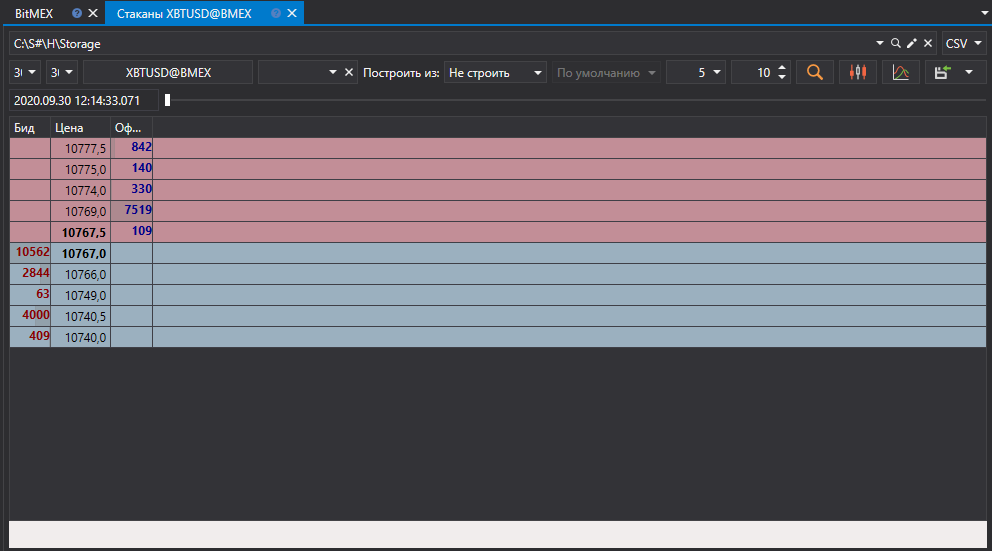

# Стаканы

В появившимся окне выбрать интересуемый диапазон времени, выбрать инструмент и нажать кнопку :

> [!TIP]
> Стаканы могут быть созданы из [файлов лога заявок и Level 1](../any_market_data_types.md). Кроме того можно настроить глубину и период обновления стакана.

Полученные значения можно [экспортировать в нужный формат](../export_data.md).
