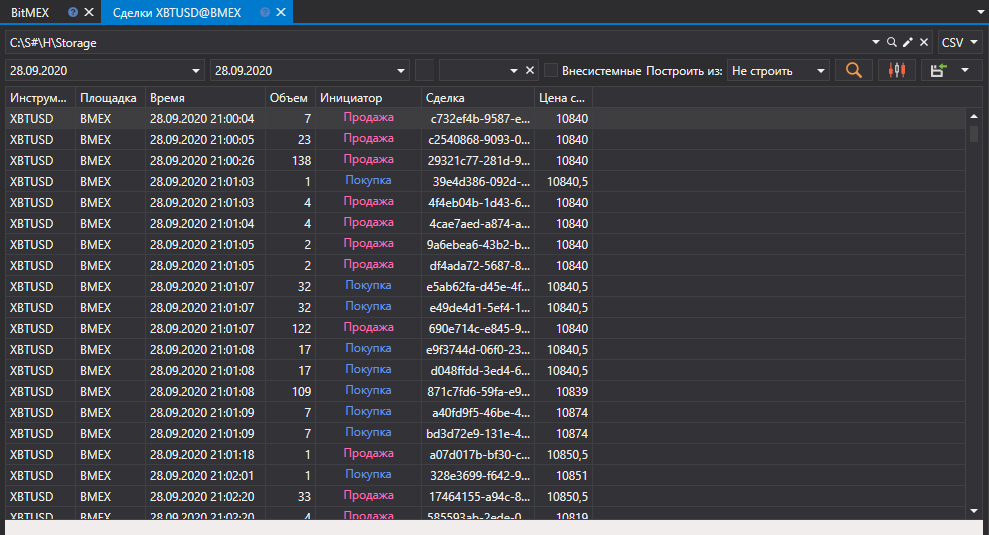

# Сделки (Тики)

В появившемся окне выбрать интересуемый диапазон времени, выбрать инструмент и нажать кнопку :

Для выгрузки внесистемных сделок необходимо установить галочку в поле **Внесистемные**.

Полученные значения можно [экспортировать в нужный формат](../export_data.md).
