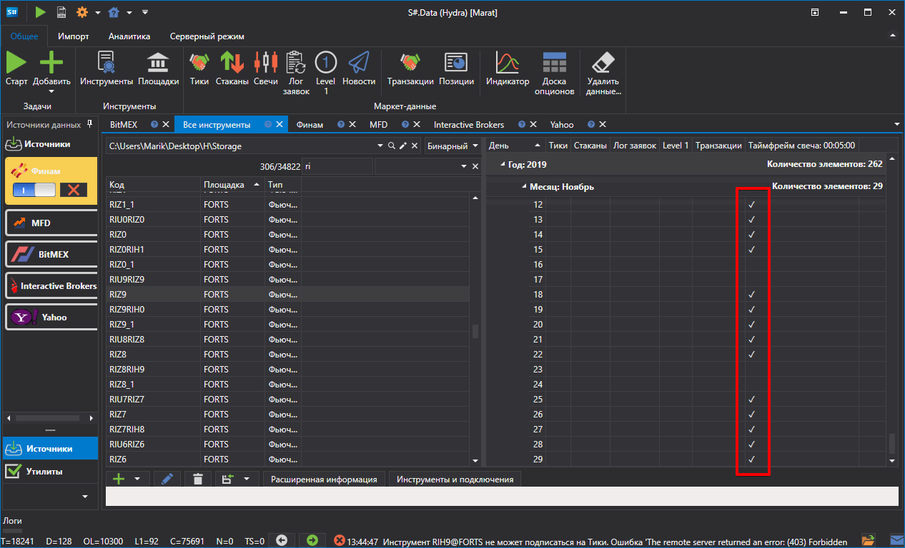
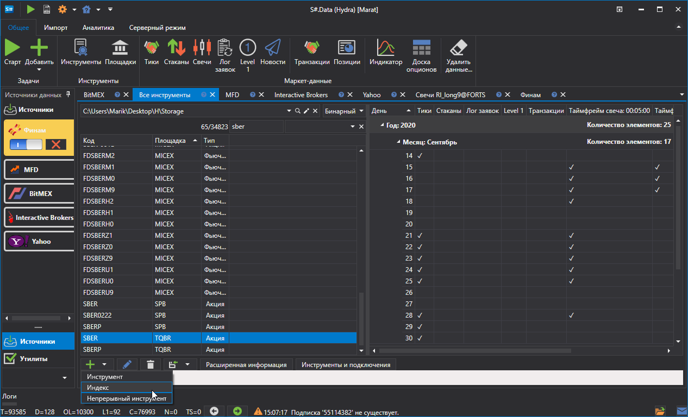
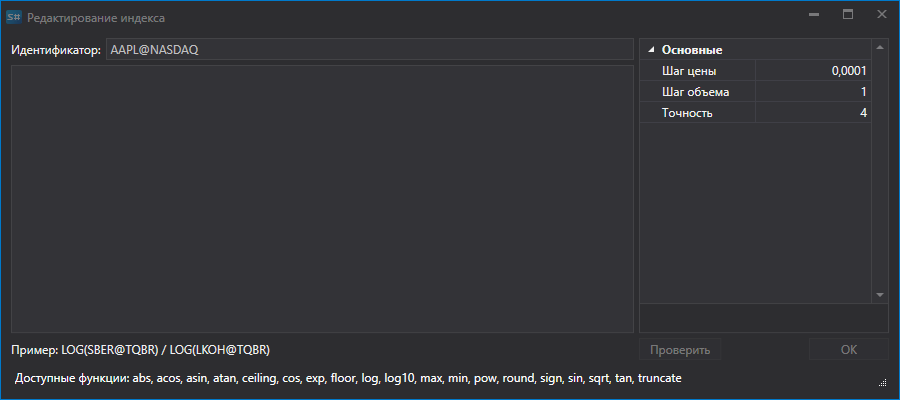
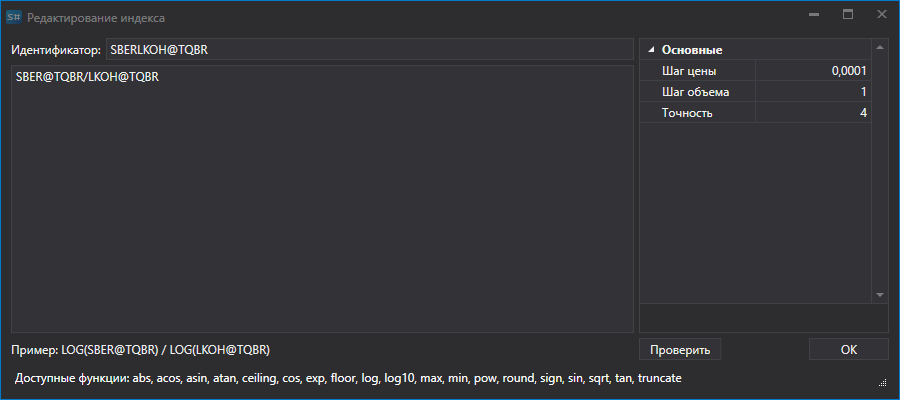
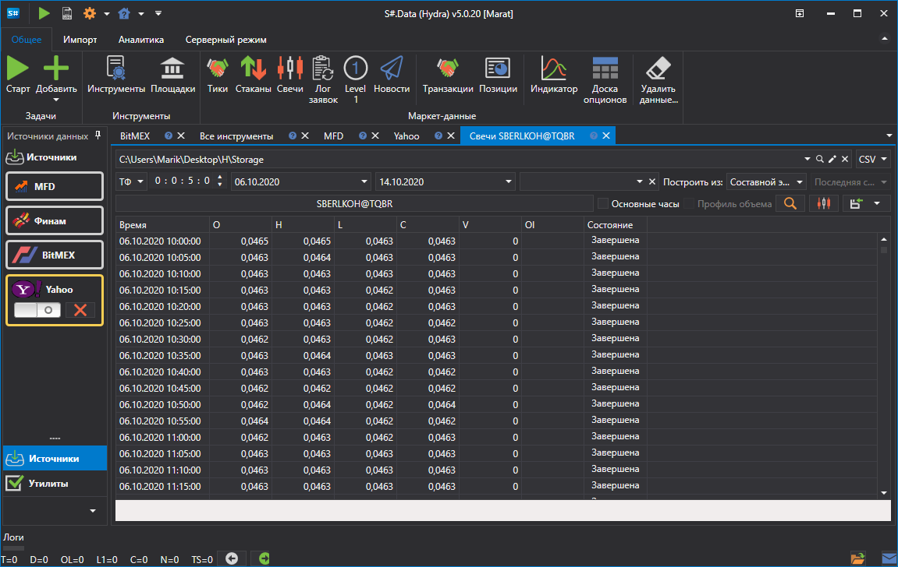
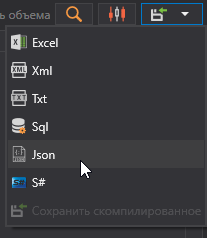

# Индекс

Программа [S\#.Data](Hydra.md) позволяет пользователю создать свой индекс.

Для этого на вкладке **Общее** нужно выбрать **Инструменты**, появится вкладка **Все инструменты.**

Перед тем как создавать **Индекс**, необходимо проверить, какие маркет\-данные есть. Для этого выбирается путь где лежат данные и по очереди просматриваются инструменты, которые предполагается будут участвовать в расчете индекса. Если имеются пропуски, то необходимо докачать нужные маркет\-данные (например, с **Финама**).

В качестве примера будет рассмотрен индекс отношений инструментов LKOH@TQBR\/SBER@TQBR

1. Первый шаг \- создание **Индекса**. Для этого необходимо нажать на вкладке **Все инструменты.** кнопку **Создать инструмент\=\>Индекс**

   
2. После чего появится окно следующего вида:

   
3. Для создания инструмента **Индекса** необходимо задать имя и добавить математическую формулу комбинации нескольких инструментов. Совместно со стандартными математическими операторами можно использовать следующие функции:
   - **abs(a)** \- Возвращает абсолютное значение числа.
   - **acos(a)** \- Возвращает угол, косинус которого равен указанному числу.
   - **asin(a)** \- Возвращает угол, синус которого равен указанному числу.
   - **atan(a)** \- Возвращает угол, тангенс которого равен указанному числу.
   - **ceiling(a)** \- Возвращает наименьшее целое число, которое больше или равно заданному числу.
   - **cos(a)** \- Возвращает косинус указанного угла.
   - **exp(a)** \- Возвращает значение **e**, возведенное в указанную степень.
   - **floor(a)** \- Возвращает наибольшее целое число, которое меньше или равно указанному числу.
   - **log(a)** \- Возвращает натуральный логарифм (с основанием **e**) указанного числа.
   - **log10(a)** \- Возвращает логарифм с основанием 10 указанного числа.
   - **max (a, b)**\- Возвращает большее из двух десятичных чисел.
   - **min(a, b)** \- Возвращает меньшее из двух десятичных чисел.
   - **pow(a, b)** \- Возвращает указанное число, возведенное в указанную степень.
   - **sign(a)** \- Возвращает целое число, указывающее знак указанного числа.
   - **sin(a)** \- Возвращает синус указанного угла.
   - **sqrt (a)**\- Возвращает квадратный корень из указанного числа.
   - **tan(a)** \- Возвращает тангенс указанного угла.
   - **truncat(a)** \- Вычисляет целую часть указанного числа.
4. Записываем математическую операцию, на основе которой будет вычисляться индекс.

   
5. Далее, необходимо нажать кнопку [Свечи](HydraExportCandles.md) на вкладке **Общее**, выбрать полученный инструмент **Индекс**, период данных, в поле **Построить из:** установить значение **Составной элемент**. После чего нажать кнопку.

   

Сгенерированные данные можно экспортировать в форматы Excel, xml или txt. Экспорт выполняется при помощи раскрывающегося списка:

